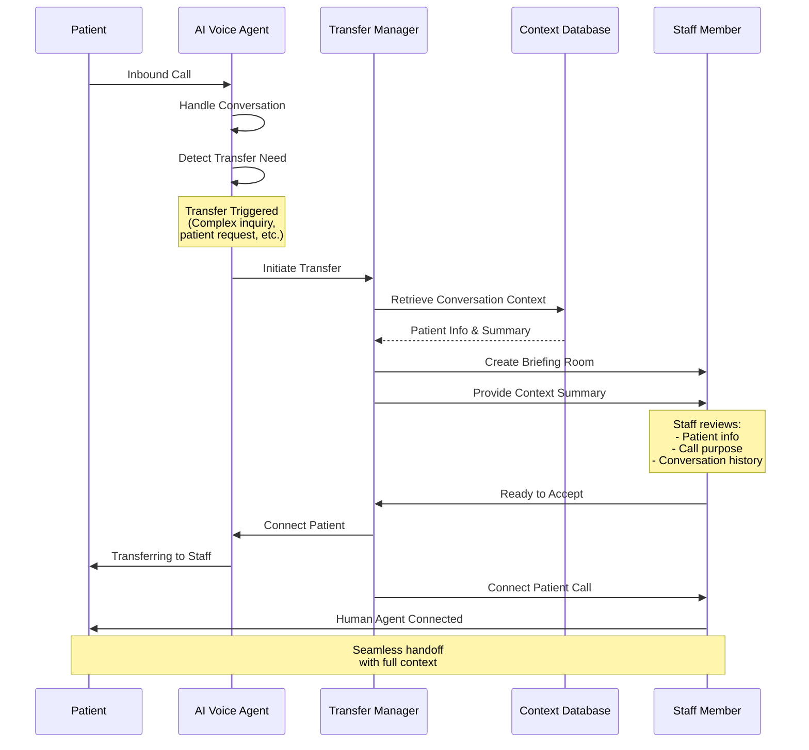

<!-- credit: Image Generated by Google Gemini Nano Banana -->

## Table of contents

## TL;DR

Warm call transfer enables AI Voice Agents to seamlessly transfer calls to human staff with complete conversation context so that the end-user experience is seamless and natural.

- **Problem**: Traditional cold transfers force patients to repeat information
- **Solution**: Call transfer to human agent after AI provides the context to the human agent.
- **Technology**: Built with Twilio (telephony infrastructure), LiveKit (SDK and infrastructure for managing calls and providing SDK to handle different system elements like audio processing, STT, TTS, etc.), and multiple STT/TTS providers for the AI agent.
- **Key Feature**: AI agent handles the conversation and initiates the transfer to the human agent if requested by the user. There were other features, but they were not relevant to the topic.
- **Result**: Seamless handoffs that feel natural and professional

## Introduction

As we are entering the year 2026. I would like to share some of the work I have been doing in the area of voice agents over the last year. I've worked on different solutions and implemented various features over the last year. One of the interesting features among many is the **warm call transfer**. This feature is designed to transfer the call from an AI voice agent to a human agent in a seamless way so that the end-user experience is seamless and natural.

## What is Warm Call Transfer?

One of the biggest challenges in implementing voice agents is handling situations where the AI needs to transfer a call to a human agent. Traditional **cold transfers** simply connect the caller to a staff member, forcing the patient to repeat everything they've already told the AI. This creates frustration and wastes time.

**Warm call transfer** solves this problem by enabling AI Voice Agents to seamlessly hand off calls to human staff members while preserving complete conversation context. Unlike traditional cold transfers, where callers must repeat their information, warm transfers ensure the human agent receives:

- **Complete conversation history**: Everything discussed between the patient and AI. We can control the context that is transferred to the human agent. For example, we can transfer the entire conversation history or only the relevant information.
- **Patient identification**: Name, contact information, and verification status
- **Call purpose**: Why the patient called and what they're trying to accomplish.
- **Collected information**: Any data gathered during the conversation (appointment preferences, questions asked, etc.)
- **Transfer reason**: Why the AI determined human intervention was needed

This allows the human agent to pick up exactly where the AI left off, creating a seamless experience for the patient. The transfer feels natural and professional, as if the staff member was listening the whole time.

### How Warm Transfer Differs from Cold Transfer

**Cold Transfer (Traditional)**:

1. AI agent: "Let me transfer you to our staff."
2. _Call connects to staff member_
3. Staff: "Hello, how can I help you?"
4. Patient: _Must repeat entire conversation_

**Warm Transfer (Our Implementation)**:

1. AI agent: "Let me connect you with someone who can help."
2. _Briefing room created - staff reviews context_
3. Staff: "Hello [Patient Name], I understand you're calling about [specific issue]. Let me help you with that."
4. Patient: _Continues conversation seamlessly_

## Architecture

The warm call transfer system is built on a modern, real-time architecture using **Twilio** for telephony and **LiveKit** for audio processing, with multiple STT/TTS providers for the AI agent.

### Key Components

- **Transfer Manager**: Orchestrates the transfer process, monitors conversation state, retrieves context, and creates briefing rooms for staff members.

- **Context Database**: Stores conversation data in real-time including patient information, conversation transcript, intent classification, and transfer triggers.

- **Briefing Room**: A virtual space where staff members review conversation context before accepting the call, displaying patient information, call purpose, and conversation highlights.

- **AI Voice Agent**: Handles initial conversation, detects when transfer is needed, prepares context summary, and initiates the transfer process.

### Transfer Flow

## How It Works

### Step-by-Step Process

1. **Call Initiation**: Patient calls through Twilio, which routes to the AI Voice Agent platform. LiveKit establishes a real-time audio connection, and the AI agent begins a conversation using STT/TTS providers.

2. **Transfer Detection**: The AI agent monitors the conversation and detects when transfer is needed. Triggers include patient requests, complex inquiries, emotional cues, or business logic requiring human intervention. This is basically something that we can achieve by using LLM tool calls or the MCP server.

3. **Context Preparation**: When transfer is triggered, the Transfer Manager retrieves all relevant data (patient info, conversation transcript, call purpose, collected data) and packages it into a structured summary.

4. **Briefing Room**: A briefing room is created for available staff members, displaying patient information, call purpose, conversation highlights, and transfer reason. Staff can review the context before accepting.

5. **Connection**: Once staff accepts, LiveKit bridges the audio connection between the patient and staff member. The AI agent announces the transfer, and the staff member greets the patient with full context, allowing seamless continuation of the conversation.

## Technology Stack

- **Twilio**: Handles telephony infrastructure including inbound call routing, call management, and integration with PSTN/SIP networks.

- **LiveKit**: Provides the real-time audio pipeline with low-latency WebRTC streaming, managing connections between Twilio and the AI platform.

- **STT/TTS Providers**: Multiple speech-to-text and text-to-speech providers for converting audio to text and generating natural-sounding speech.

## Benefits

**For Healthcare Practices**:

- Reduces call handling time by eliminating repetition
- Allows staff to prepare before accepting calls
- Improves patient satisfaction scores

**For Patients**:

- No need to repeat information
- Faster resolution of inquiries
- Smooth, professional transitions between AI and human

## Conclusion

Warm call transfer is a critical and useful feature for AI Voice Agents in healthcare, but it can be used in any industry where customer service is important. By preserving conversation context and enabling seamless handoffs, it transforms the customer experience while improving operational efficiency. So that the enduser experience is seamless and natural.
