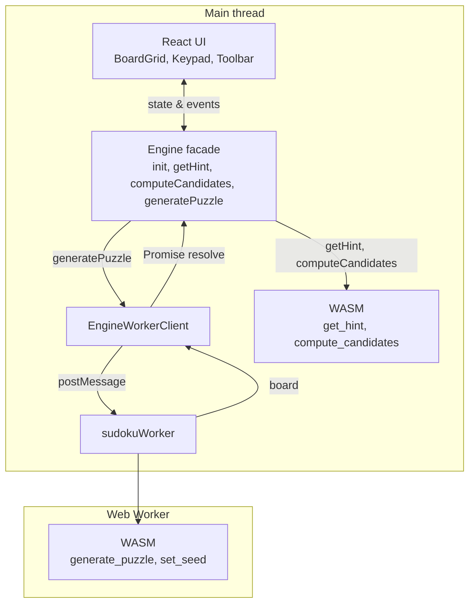

## Table of contents

## Introduction

I wanted a Sudoku app that felt fast and worked offline—something I could open on my phone and play without waiting on a server or fighting a sluggish grid. So I built one. React for the UI, Rust compiled to WebAssembly for the core logic, and no backend. The goal was simple: a production-ready puzzle that runs entirely in the browser and leans on WASM where performance actually matters.

Going frontend-only was a deliberate choice. No server means no latency, no auth, no database. You deploy a static site; the puzzle engine lives in the browser. For a game like Sudoku, that’s enough. Performance mattered because the engine does a lot of repetitive work—validating moves, computing candidates for 81 cells, running the solver for hints and generation. On a mid-range phone, doing that in plain JavaScript would feel sluggish. I wanted taps to feel instant and generation to never block the UI.

## Choosing the Stack

React was “good enough” and I didn’t second-guess it. I needed a familiar component model and tooling; the real work was in the engine and keeping the UI thin. Chasing a newer framework wouldn’t have moved the needle. The bottleneck was never React—it was the logic underneath.

Rust and WebAssembly handle everything that has to be fast and correct: puzzle generation, solving, hints, and candidate computation. I chose Rust for the type system and the testing story. The solver, generator, and hint logic are easy to reason about and test with `cargo test`, and wasm-bindgen gives a clean JS boundary without fighting a runtime. No GC, no surprises—just a small, well-tested core that the React app calls over a thin API.

Skipping a backend was intentional. Puzzles are generated in the browser, state lives in memory, and the PWA caches assets for offline. Static site, deploy anywhere. No server to maintain or scale.

I used wasm-pack with the **web** target instead of **bundler**. The web target outputs ES modules that the browser loads directly. That played nicely with Vite—no special WASM plugin, just a dynamic import. The app loads the engine asynchronously and only marks ready when WASM has initialized, so the UI renders immediately and hints appear when the engine is ready. The bundler target would have tied me to a plugin and a different loading story; the web target kept things simple and explicit.

## Architecture

The app runs entirely in the browser. The React UI talks to a single engine facade. Hints and candidate computation call WASM on the main thread—short, non-blocking work. Puzzle generation runs in a Web Worker that loads its own WASM instance so the main thread never blocks when you tap “New Game.” The diagram below sums it up.

On the main thread, React holds board state and handles input. The engine runs `initWasm()` on first use (e.g. via `requestIdleCallback`), then uses the same WASM module for hints and candidates. When the user taps “New Game”, the engine delegates to the worker client, which posts a message to the worker. The worker initializes WASM once, calls `generate_puzzle(difficulty)`, and posts the board back. The UI shows “Generating puzzle…” until the promise resolves.

## Performance Thinking

Moving the core logic into WASM did two things: the hot paths (candidates, hints, generation) run in compiled code, and the boundary between UI and engine stayed clear so both sides could be optimized independently.

I cared more about perceived performance than micro-benchmarks. A fast solver is pointless if the board feels laggy on tap. So I focused on quick visual feedback on input—a success pulse, an error shake, completion flashes. Puzzle generation runs in a Web Worker that loads its own WASM instance, so the main thread never blocks when you tap “New Game.” I avoided extra frameworks; React, Vite, and WASM were enough. Smaller bundle, fewer moving parts.

The app was designed mobile-first from the start. Touch targets, layout, and interaction were all thought through for small screens first. That’s not an afterthought—it shapes how you build the keypad, the toolbar, and the way state updates hit the UI.

## UX and Polish

On mobile, typing into a 9×9 grid is awkward. I added a number keypad at the bottom: big digits, tap to enter. Select a cell, tap a number. The keypad also has Clear, Notes, and Hint so the main actions are one tap away. For mobile, a dedicated Clear button matters more than keyboard shortcuts. Touch was considered throughout—large hit areas, no hover-only behaviour, feedback that works without a cursor. PWA support (installable, standalone, offline) makes it feel like a real puzzle app once it’s on your home screen.

## Lessons Learned

WASM initialization had a few gotchas. It has to be async; you can only call into the module after `init()` completes. I used a wrapper that guards against double-init and deferred loading with `requestIdleCallback` (or `requestAnimationFrame`) so the first paint isn’t blocked. If the component unmounts before init finishes, a `cancelled` flag avoids calling `setWasmReady` and prevents leaks. Explicit control beat “magic” auto-loading every time.

React wasn’t the bottleneck. The expensive work lives in WASM and the worker. With `useCallback` and `useMemo` where it mattered, re-renders stayed cheap. The lesson was to optimize where the cost actually is, not where the framework gets the blame.

Perceived performance mattered more than raw speed. Users notice instant feedback and non-blocking generation more than a solver that’s twice as fast. Investing in responsiveness and visual feedback paid off more than squeezing the last bit out of the engine.

## Closing Thoughts

Next I’d improve puzzle quality and difficulty—tuning removal counts, uniqueness, and maybe a stronger solver for better hints. I’d consider light animations or an experiment with SolidJS to see how it feels, but React has been fine so far.

The main takeaway: small, focused apps are underrated. No backend, no auth, one problem (Sudoku in the browser), one goal (fast, clean, mobile-first). If you’ve been putting off a small idea because it doesn’t feel “full-stack” enough, it’s worth a shot. Sometimes the best thing to build is the one that does one thing well.
