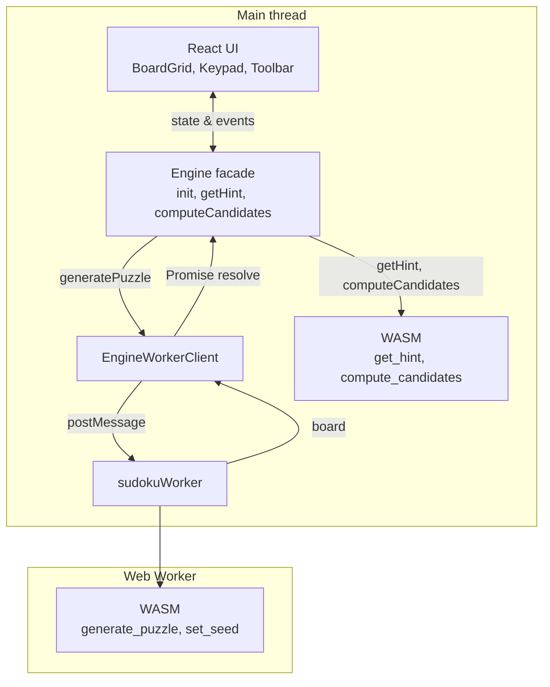

## Table of contents

## Introduction

I wanted to build a Sudoku app. When I explored the web, I found countless options—many of them work great. But I wanted to build something for fun, to put my knowledge and curiosity to work. That got me thinking: what if I focused on performance and speed? What if I pushed the boundaries of what's possible in the browser?

The result: a fast, offline-first Sudoku app built with React and Rust/WASM, running entirely in the browser with no backend.

**Try it live**: [https://sudonova.rajendrasinh.com/](https://sudonova.rajendrasinh.com/)

## At a glance

- **Goal**: fast, offline-first Sudoku that runs entirely in the browser.
- **UI**: React renders the grid, keypad, and game chrome (Non interactive elements of the application).
- **Engine**: Rust + WebAssembly handle anything performance-sensitive.
- **Concurrency**: a Web Worker owns puzzle generation so the main thread stays responsive.

In very rough pseudocode, the app behaves like this:

```text
onAppStart():
  renderEmptyBoard()
  initWasmEngineInBackground()

onCellTap(cell):
  selectCell(cell)

onNumberTap(n):
  board = engine.applyMove(board, selectedCell, n)
  updateUI(board)
  if !engine.isMoveValid(board, selectedCell, n):
    showErrorFeedback()

onHintTap():
  hint = engine.getHint(board)
  highlightHint(hint)

onNewGameTap(difficulty):
  showGeneratingState()
  board = await engineWorker.generatePuzzle(difficulty)
  hideGeneratingState()
  updateUI(board)
```

## Choosing the Stack

### The JavaScript problem

A Sudoku engine does repetitive work—validating moves, computing candidates for 81 cells, running solvers for hints and generation. On mobile, plain JavaScript struggles: GC pauses cause stutters, and the interpreted nature means even optimized code runs slower than compiled alternatives.

### WASM + Rust:

The performance-critical choice. Handles generation, solving, hints, and candidates. WASM runs at near-native speed, compiled ahead of time. Rust adds type safety, zero-cost abstractions, and no garbage collector—perfect for hot paths that run thousands of times per game.

Rust's type system and `cargo test` make the core logic easy to reason about. wasm-bindgen provides a clean JS boundary. No GC, no runtime surprises—just predictable, fast code.

**Performance comparison**:

- **JavaScript**: ~50-100ms puzzle generation, perceptible lag on candidate computation, GC pauses cause stutters
- **WASM/Rust**: ~10-20ms puzzle generation, instant candidate computation, no GC pauses

### React

I was familiar with React. The main bottleneck was the Sudoku engine, So decided to go with React for the first release. Easy to optimize with `useMemo` and `useCallback`.

### No backend

Puzzles generate in-browser, state lives in memory, PWA caches for offline. Static site, deploy anywhere.

**wasm-pack web target**: Outputs ES modules that load directly in the browser. Works with Vite via dynamic import—no WASM plugin needed. Engine loads asynchronously; UI renders immediately, hints appear when ready.

## Architecture

React UI → engine facade → WASM (main thread for hints/candidates) or Web Worker (for generation). The diagram below shows the flow:



### Engine boundaries in code-ish form

The UI only calls a tiny engine surface; everything else stays hidden behind it:

```typescript
// main thread – used by React components
type Board = number[][];

export async function initEngine() {
  await initWasmIfNeeded(); // one-time WASM init
  await initWorkerIfNeeded(); // one-time worker init
}

export function computeCandidates(board: Board, cell: Cell) {
  return wasm_compute_candidates(board, cell);
}

export function getHint(board: Board): Hint {
  return wasm_get_hint(board);
}

export function generatePuzzle(difficulty: Difficulty): Promise<Board> {
  return workerRequest({ type: "generate", difficulty });
}
```

And on the worker side:

```typescript
// sudokuWorker.ts (runs off the main thread)
self.onmessage = async event => {
  if (event.data.type === "generate") {
    await initWasmIfNeeded();
    const board = wasm_generate_puzzle(event.data.difficulty);
    self.postMessage({ board });
  }
};
```

**Flow**: React holds board state. Engine initializes WASM on first use (via `requestIdleCallback`). "New Game" → worker client → worker posts message → worker WASM generates puzzle → posts board back → UI updates.

## Performance Thinking

**WASM**: Hot paths run in compiled code. Candidates and hints run on the main thread (fast enough to be non-blocking), while generation runs in a worker to keep the UI responsive. Clear UI/engine boundary enables independent optimization.

**Perceived performance**: Visual feedback (success pulse, error shake) matters more than raw solver speed.

**Mobile-first**: Touch targets, layout, and interactions designed for small screens from the start. Minimal stack: React, Vite, WASM—smaller bundle, fewer moving parts.

### Lighthouse Results

The performance-focused architecture paid off. Here are the Lighthouse scores:


- **Performance**: 99/100
- **Accessibility**: 100/100
- **Best Practices**: 100/100
- **SEO**: 100/100

The near-perfect performance score validates the WASM approach—instant interactions, non-blocking generation, and optimized bundle size all contribute to a fast, responsive experience.

## UX and Polish

**Keypad**: Bottom-mounted number pad for mobile. Tap cell → tap number. Includes Clear, Notes, Hint—one tap away.

**Touch-first**: Large hit areas, no hover-only behavior, visual feedback without cursor. PWA support (installable, offline) makes it feel native once installed.

## Lessons Learned

**WASM init**: Must be async. Guard against double-init, defer with `requestIdleCallback` to avoid blocking first paint. Handle unmounts with a `cancelled` flag to prevent leaks. Explicit control > magic auto-loading.

**React wasn't the bottleneck**: Expensive work is in WASM/worker. `useCallback`/`useMemo` where needed kept re-renders cheap. Optimize where the cost actually is.

**Perceived > raw speed**: Instant feedback and non-blocking generation matter more than a 2x faster solver.

## Closing Thoughts

**Next steps**: Improve puzzle quality (removal counts, uniqueness), stronger solver for hints, maybe light animations or SolidJS experiment.

**Takeaway**: Small, focused apps are underrated. No backend, no auth, one problem, one goal. If you've been putting off a small idea because it doesn't feel "full-stack" enough, it's worth a shot. Sometimes the best thing to build is the one that does one thing well.

**Try it**: [https://sudonova.rajendrasinh.com/](https://sudonova.rajendrasinh.com/)
