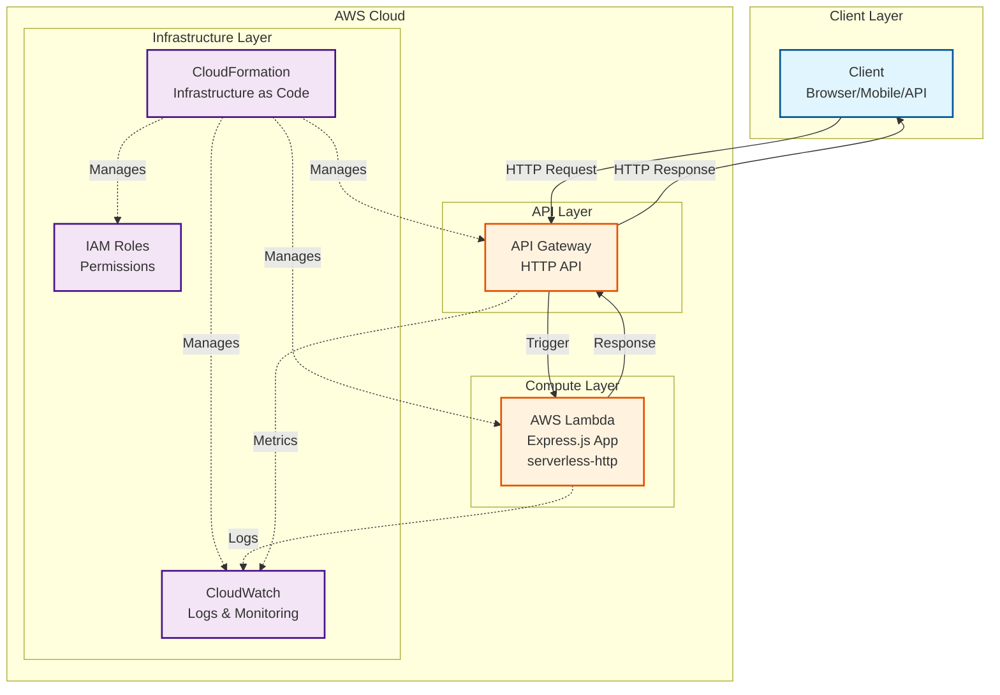
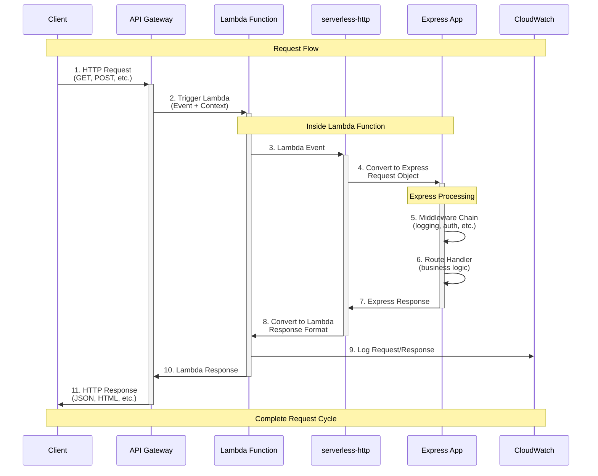

## Table of contents

## TL;DR

Get started with Serverless Framework and deploy your first Express API to AWS Lambda:

```bash
# Install Serverless Framework
$ npm install -g serverless

# Create project using interactive CLI
$ serverless

# Select "AWS - Node.js - Express API" template
# Name your service (e.g., my-serverless-api)
# Navigate to project directory
$ cd my-serverless-api

# Deploy to AWS
$ serverless deploy
```

**What you get:**

- Express API running on AWS Lambda
- API Gateway endpoint automatically configured
- CloudFormation stack managing infrastructure
- Ready-to-use project structure

## Introduction

Recently, I was working on one of my clients' projects, and I was using Serverless Framework to deploy my APIs to AWS Lambda. I was very impressed with the ease of use and the power of the framework. I decided to write a series of blog posts to share my experience with the framework.

The Serverless Framework removes deployment complexity on AWS Lambda, allowing you to focus on Express code while it automates setup, deployment, and scaling.

This article shows how to set up and deploy a serverless Express API with a public AWS endpoint.

**Series Progress:**

- **Part 1** (This article): **Getting Started** - Setup and basic deployment
- **Part 2**: **[Development Workflow](/posts/serverless-express-api-part-2-development-workflow)** - Local development and testing
- **Part 3**: **[Multi-Stage Deployments & CI/CD](/posts/serverless-express-api-part-3-multi-stage-deployments)** - Environment management and CI/CD
- **Part 4**: **[Production Monitoring & Security](/posts/serverless-express-api-part-4-monitoring-security)** - Monitoring, logging, and security
- **Part 5**: **[Performance & Cost Optimization](/posts/serverless-express-api-part-5-performance-optimization)** - Performance tuning and cost management

## Understanding Serverless

**New to serverless?** Here's what makes it special:

### Traditional Server vs Serverless

**Traditional Server:**

- You rent/buy a server that runs 24/7
- You manage OS, security updates, and scaling
- You pay continuously, even when no one uses your API
- You handle server maintenance and monitoring

**Serverless (AWS Lambda):**

- AWS runs your code only when requests come in
- Automatic scaling from 0 to millions of requests
- You only pay for actual usage (requests + execution time)
- AWS handles all server management and maintenance

### Real-World Cost Example

**Traditional Server:**

- Minimum cost: ~$50/month (even with 0 users)
- Fixed cost regardless of usage
- Additional costs for scaling, monitoring, and backups

**Serverless:**

- $0.00 with 0 users
- $0.20 for 1 million requests
- Automatic scaling included
- Built-in monitoring and logging

### Architecture Overview

Here's what we're building in this series:



**How it works:**

1. **Client** sends HTTP request (GET, POST, etc.)
2. **API Gateway** receives request and triggers Lambda
3. **Lambda** runs your Express.js application code
4. **Response** flows back through API Gateway to client
5. **CloudFormation** manages all AWS resources automatically

**Benefits of this architecture:**

- **Automatic scaling**: Handle 1 to 1M+ requests seamlessly
- **Pay-per-use**: Only pay when requests are actually processed
- **Zero server management**: AWS handles all infrastructure concerns
- **Built-in reliability**: AWS provides 99.95% uptime SLA
- **Global deployment**: Deploy to multiple regions easily

## Prerequisites

Before we begin, ensure you have the following setup in place:

### 1. Node.js (Required)

Node.js 18.x or higher is installed on your system.

```bash
# Verify installation
$ node --version
# Should output: v18.x.x or higher
```

> **Installation:** Download from [nodejs.org](https://nodejs.org/) or use [nvm](https://github.com/nvm-sh/nvm)
>
> **Note:** I will personally recommend using [nvm](https://github.com/nvm-sh/nvm) to manage multiple Node.js versions.

### 2. AWS CLI (Required)

AWS Command Line Interface installed and configured.

```bash
# Verify installation
$ aws --version
# Should output: aws-cli/2.x.x or higher
```

> **Installation:** Follow the [AWS CLI installation guide](https://docs.aws.amazon.com/cli/latest/userguide/getting-started-install.html)

### 3. AWS Credentials (Required)

AWS credentials configured with appropriate permissions.

```bash
# Configure AWS credentials
$ aws configure

# Or use a named profile
$ aws configure --profile myproject

# Verify configuration
$ aws sts get-caller-identity
```

**Required IAM permissions:**

These are very exhaustive permissions, and you can also use the [AWS Policy Generator](https://awspolicygen.s3.amazonaws.com/policygen.html) to generate the necessary permissions, which are very specific to your use case and more granular. Refer [Serverless Framework IAM policy guide](https://www.serverless.com/framework/docs/providers/aws/guide/iam) for more details.

- `lambda:*` - Lambda function management
- `apigateway:*` - API Gateway configuration
- `cloudformation:*` - Stack management
- `iam:CreateRole`, `iam:AttachRolePolicy` - IAM role creation
- `logs:*` - CloudWatch Logs access

## Step 1: Install Serverless Framework

Install the Serverless Framework globally as recommended in the [official documentation](https://www.serverless.com/framework/docs/getting-started):

```bash
$ npm install -g serverless
```

Verify installation:

```bash
$ serverless --version
# Should output: Framework Core: 4.x.x or higher
```

> **Note:** You can also use `npx serverless` if you prefer not to install globally. This will still temporarily install the Serverless Framework.

## Step 2: Create Your First Serverless Project

Use the Serverless Framework CLI to create a new project with the recommended template:

```bash
# Start the interactive project creation
$ serverless
```

This command launches an interactive setup process:

### Interactive Setup Process

1. **Select Template**: Choose "AWS - Node.js - Express API" from the available templates. You can also choose other templates if you want to.
2. **Service Name**: Enter your service name (e.g., `my-serverless-api`) or press Enter for default
3. **Create Or Select An Existing App**: Choose "Skip Adding An App"

The CLI creates a new directory with your service name and generates all necessary files:

```
my-serverless-api/
├── handler.js          # Lambda function with Express app
├── serverless.yml      # Service configuration
├── package.json        # Node.js dependencies and scripts
├── .gitignore          # Git ignore rules
└── README.md           # Project documentation
```

Navigate to your project directory and install the dependencies:

```bash
# Navigate to your project directory
$ cd my-serverless-api

# Install dependencies. I am using npm here. You can use yarn or pnpm if you want to.
$ npm install
```

### Understanding the Generated Files

**`handler.js`** - Contains your Express application wrapped for Lambda:

```javascript
const serverless = require("serverless-http");
const express = require("express");

const app = express();

app.get("/", (req, res, next) => {
  return res.status(200).json({
    message: "Hello from root!",
  });
});

// Rest of the routes...
// ......

exports.handler = serverless(app);
```

**`serverless.yml`** - Defines your service configuration:

```yaml
service: my-serverless-api

provider:
  name: aws
  runtime: nodejs20.x
  region: us-east-1

functions:
  api:
    handler: handler.handler
    events:
      - httpApi: "*"
```

**`package.json`** - Includes essential dependencies and scripts:

```json
{
  "dependencies": {
    "express": "^4.19.2",
    "serverless-http": "^3.2.0"
  }
}
```

## Step 3: Customise Your Express Application

Let's enhance the basic Express application with logging and error handling. I'm not going to add more api endpoints as they are just any express routes that you would normally add in your project.

```javascript
const serverless = require("serverless-http");
const express = require("express");

const app = express();

// Middleware
app.use(express.json());

// Request logging
app.use((req, res, next) => {
  console.log(`${req.method} ${req.path}`);
  next();
});

// Routes
app.get("/", (req, res, next) => {
  return res.status(200).json({
    message: "Hello from root!",
  });
});

// Rest of the routes...
// ......
// ......

// 404 handler
app.use((req, res) => {
  res.status(404).json({ error: "Not Found" });
});

// Error handler
app.use((err, req, res, next) => {
  console.error("Error:", err);
  res.status(500).json({ error: "Internal Server Error" });
});

// Export handler for Lambda
exports.handler = serverless(app);
```

**Key features added:**

- Request logging middleware
- Error handling middleware

## Step 4: Configure Your Service

Let's enhance the basic `serverless.yml` configuration for better deployment control:

```yaml
service: my-serverless-api

provider:
  name: aws
  runtime: nodejs20.x
  region: us-east-1
  stage: ${opt:stage, 'dev'}
  memorySize: 512
  timeout: 30

functions:
  api:
    handler: handler.handler
    events:
      - httpApi: "*"
```

**Configuration breakdown:**

- **`service`** - Unique identifier for your serverless application
- **`provider.runtime`** - Node.js version (20.x is latest LTS)
- **`provider.region`** - AWS region for deployment
- **`provider.stage`** - Environment stage (dev, staging, production) - Dynamic variable that defaults to 'dev' if not specified
- **`provider.memorySize`** - Memory allocation for the Lambda function (512MB)
- **`provider.timeout`** - Maximum execution time for the Lambda function (30 seconds)
- **`functions.api.handler`** - Path to Lambda handler function
- **`functions.api.events`** - HTTP API event with wildcard routing

## Step 5: Deploy to AWS

Deploy your serverless API to AWS Lambda:

```bash
$ serverless deploy
```

**Deployment process:**

1. Code is packaged and zipped
2. CloudFormation stack is created/updated
3. Lambda function is deployed
4. HTTP API Gateway is configured
5. IAM roles are set up
6. API endpoint URL is returned

**Expected output:**

```
Deploying "my-serverless-api" to stage "dev" (us-east-1)

✔ Service deployed to stack my-serverless-api-dev (112s)

endpoint: ANY - https://abc123xyz.execute-api.us-east-1.amazonaws.com
functions:
  api: my-serverless-api-dev-api (1.5 MB)
```

## Step 6: Test Your Deployed API

Test your API endpoints using the provided URL:

```bash
# Save endpoint URL from deployment output
ENDPOINT="https://abc123xyz.execute-api.us-east-1.amazonaws.com"

# Test root endpoint
curl $ENDPOINT/

# Test other endpoints with similar commands by changing the path.
```

**Expected responses:**

Root endpoint:

```json
{
  "message": "Hello from root!"
}
```

## Understanding the data flow in the architecture.

Your deployed application follows this architecture. This is the same architecture that you will use for your production deployment.



**Detailed Request Flow:**

1. **Client** makes an HTTP request to the API Gateway endpoint
2. **API Gateway** receives the request and triggers the Lambda function
3. **Lambda** receives the event and context from API Gateway
4. **serverless-http** converts the Lambda event to an Express-compatible request
5. **Express app** processes the request through middleware chain
6. **Route handler** executes your business logic
7. **Express** returns the response object
8. **serverless-http** converts Express response to Lambda response format
9. **Lambda** logs the request/response to CloudWatch
10. **Lambda** returns the formatted response to API Gateway
11. **API Gateway** sends the HTTP response back to the client

## Basic Troubleshooting

### Deployment Issues

**Issue:** Permission denied errors during deployment.

**Solution:** Verify AWS credentials and permissions:

```bash
# Check your AWS identity
$ aws sts get-caller-identity

# Ensure your IAM user has required permissions
```

**Issue:** Service name conflicts.

**Solution:** Use a unique service name in `serverless.yml`:

```yaml
service: my-unique-api-name-${self:provider.stage}
```

### Function Errors

**Issue:** Function timeout errors.

**Solution:** Increase timeout in `serverless.yml`:

```yaml
provider:
  timeout: 60 # seconds
```

## Cleaning Up Resources

When you're done experimenting, remove all AWS resources:

```bash
$ serverless remove
```

**Warning:** This permanently deletes all resources including Lambda functions, API Gateway, and CloudWatch logs.

## Quick Reference

```bash
# Create new project
$ serverless                    # Interactive project creation

# Deploy
$ serverless deploy            # Deploy to default stage
$ serverless deploy --stage production  # Deploy to specific stage

# Remove resources
$ serverless remove           # Clean up all AWS resources

# Get service info
$ serverless info             # Show deployment information
```

## Conclusion

Congratulations! You've successfully:

- Set up Serverless Framework
- Created your first Express API
- Deployed to AWS Lambda
- Tested your live API endpoints
- Understood the basic architecture

## What's Next?

Ready to continue? Check out **[Part 2: Development Workflow](/posts/serverless-express-api-part-2-development-workflow)** to learn about local development strategies and testing approaches.
