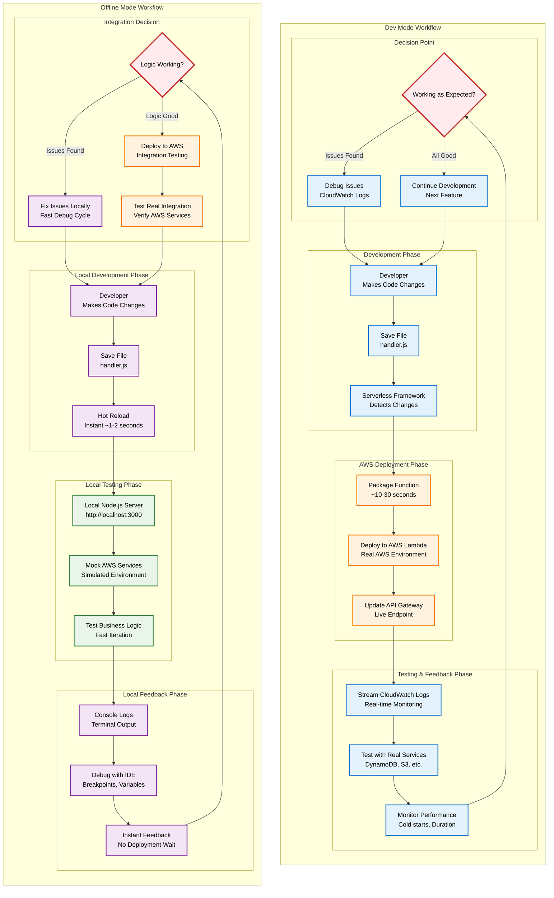
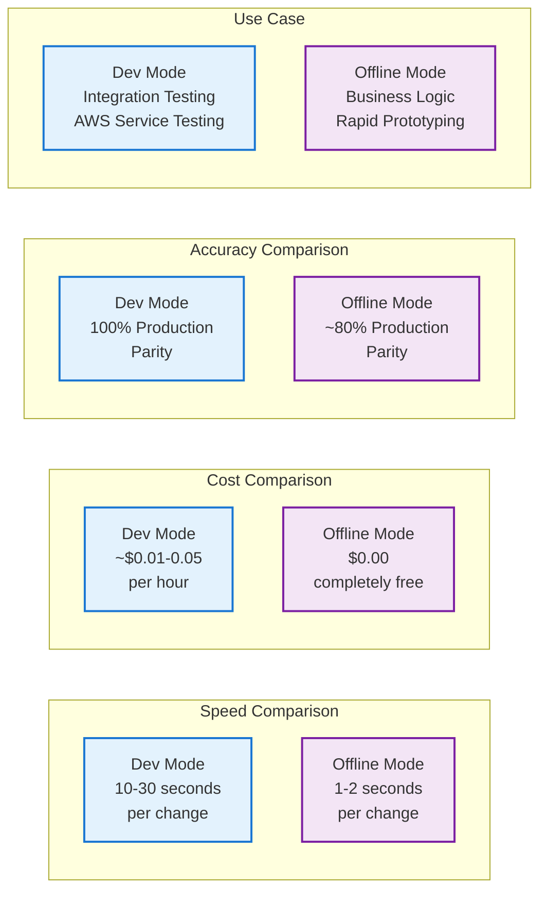

## Table of contents

## TL;DR

The Serverless Framework offers two excellent development approaches:

**Dev Mode (Recommended)** - Real-time AWS integration using `serverless dev`:

```bash
# Start dev mode
$ serverless dev
# or
$ npm run dev
```

**Offline Mode (Traditional)** - Traditional local development using `serverless offline`:

Even if it's traditional, it's still a powerful tool for local development.

```bash
# Install additional dependency first
$ npm install --save-dev serverless-offline

# Start offline server
$ serverless offline
# or
$ npm start
```

**Key Differences:**

- **Dev Mode**: Deploys to AWS, streams logs, real AWS services, typically redeploys in 10-30 seconds
- **Offline Mode**: Local only, instant startup, no AWS costs, mock services

**When to use:**

- Use **dev mode** for integration testing and AWS service interactions
- Use **offline mode** for rapid prototyping and offline development

## Introduction

Effective local development is crucial for building serverless applications efficiently. The Serverless Framework provides two powerful approaches for developing and testing your Express APIs locally, each with distinct advantages.

This guide covers both development methods in detail, helping you choose the right approach for different scenarios and optimise your development workflow.

**Series Progress:**

- **Part 1**: **[Getting Started](/posts/serverless-express-api-part-1-getting-started)** - Setup and basic deployment
- **Part 2** (This article): **Development Workflow**
- **Part 3**: **[Multi-Stage Deployments & CI/CD](/posts/serverless-express-api-part-3-multi-stage-deployments)** - Environment management and CI/CD
- **Part 4**: **[Production Monitoring & Security](/posts/serverless-express-api-part-4-monitoring-security)** - Monitoring, logging, and security
- **Part 5**: **[Performance & Cost Optimization](/posts/serverless-express-api-part-5-performance-optimization)** - Performance tuning and cost management

## Prerequisites

Before proceeding, ensure you have completed Part 1 of this series or have:

- Serverless Framework installed globally
- A working serverless Express API project
- AWS credentials configured
- Basic understanding of Express.js

If you need to catch up, follow **[Part 1: Getting Started](/posts/serverless-express-api-part-1-getting-started)** first.

## Development Environment Setup

First, add the necessary development dependency to your project:

```bash
# Navigate to your project directory
$ cd my-serverless-api

# Install serverless-offline for local development
$ npm install --save-dev serverless-offline
```

Update your `serverless.yml` to include the `serverless-offline` plugin:

```yaml
service: my-serverless-api

provider:
  name: aws
  runtime: nodejs20.x
  region: us-east-1
  stage: ${opt:stage, 'dev'}

functions:
  api:
    handler: handler.handler
    events:
      - httpApi: "*"

plugins:
  - serverless-offline
```

Update your `package.json` scripts for both development modes (dev mode and offline mode):

```json
{
  "scripts": {
    "dev": "serverless dev",
    "start": "serverless offline",
    "deploy": "serverless deploy",
    "deploy:dev": "serverless deploy --stage dev",
    "deploy:prod": "serverless deploy --stage production",
    "logs": "serverless logs -f api --tail",
    "remove": "serverless remove"
  }
}
```

## Option 1: Dev Mode (Cloud-Connected Development)

The new `serverless dev` command provides a modern development experience by deploying your function to AWS and streaming logs, errors, and responses directly to your terminal in real-time. This setup allows you to test your API endpoints with real AWS services in real-time.

### Starting Dev Mode

```bash
# Start dev mode
$ serverless dev

# Or using npm script
$ npm run dev
```

**Expected output:**

```
Dev Mode - Watching your service for changes and streaming logs

✔ Service deployed to stack my-serverless-api-dev (45s)

endpoint: ANY - https://abc123xyz.execute-api.us-east-1.amazonaws.com
functions:
  api: my-serverless-api-dev-api

Watching for changes...
```

### Dev Mode Features

**Real-time deployment** - Code changes trigger automatic redeployment:

```
File changed: handler.js
Deploying...
✔ Service deployed (12s)
```

- **Live AWS environment** - Uses actual AWS Lambda and API Gateway
- **Streaming logs** - See logs, errors, and responses in real-time
- **Fast feedback loop** - Typically redeploys in 10-30 seconds

### Testing Dev Mode Endpoints

```bash
# Save the endpoint URL from dev mode output
$ ENDPOINT="https://abc123xyz.execute-api.us-east-1.amazonaws.com"

# Test your API endpoints
$ curl $ENDPOINT/

# Test other endpoints with similar commands by changing the path.
```

When you make changes to your code, you'll see real-time output in your terminal like this:

```
2025-11-22 11:30:15.123 START RequestId: abc-123-def
2025-11-22 11:30:15.234 GET /
2025-11-22 11:30:15.345 END RequestId: abc-123-def
2025-11-22 11:30:15.456 REPORT Duration: 45.67ms Memory: 78MB
```

### Dev Mode Configuration

Customise dev mode behaviour using the following commands or options:

```bash
# Use a different stage for dev mode
$ serverless dev --stage development

# Use specific region
$ serverless dev --region eu-west-1

# Verbose output for debugging
$ serverless dev --verbose
```

## Option 2: Offline Mode (Local Development)

For completely offline development without AWS deployment, use `serverless-offline`. This approach runs your Express application locally using Node.js. Note that as this is local environment, it might not completely match the production environment with actual AWS services.

### Starting Offline Mode

```bash
# Start offline server
$ serverless offline

# Or using npm script
$ npm start
```

**Expected output:**

```
Starting Offline at stage dev (us-east-1)

Offline [http for lambda] listening on http://localhost:3002
Function names exposed for local invocation by aws-sdk:
   * api: my-serverless-api-dev-api

   ┌───────────────────────────────────────────────────────────────────────┐
   │                                                                       │
   │   ANY  | http://localhost:3000/dev                                    │
   │   POST | http://localhost:3000/2015-03-31/functions/api/invocations   │
   │   ANY  | http://localhost:3000/dev/{proxy*}                           │
   │   POST | http://localhost:3000/2015-03-31/functions/api/invocations   │
   │                                                                       │
   └───────────────────────────────────────────────────────────────────────┘

Server ready: http://localhost:3000 🚀
```

### Testing Offline Endpoints

```bash
# Test local endpoints
$ curl http://localhost:3000/

# Test other endpoints with similar commands by changing the path.
```

### Offline Mode Features

- **Hot reloading** - Changes to `handler.js` automatically restart the server
- **Fast iteration** - Test changes instantly without deployment
- **Full Express functionality** - All middleware and routing works locally
- **Environment detection** - Check `process.env.IS_OFFLINE` to detect local mode
- **No AWS costs** - Runs completely locally without AWS resources

### Customising Offline Mode

Customise offline mode behaviour using the following commands or options:

```bash
# Run on a different port
$ serverless offline --httpPort 4000

# Start with a specific stage
$ serverless offline --stage development

# Enable CORS for frontend development
$ serverless offline --corsAllowOrigin "*"
```

## Comparing Development Approaches

| Feature               | Dev Mode (`serverless dev`)            | Offline Mode (`serverless offline`)  |
| --------------------- | -------------------------------------- | ------------------------------------ |
| **Environment**       | Real AWS Lambda + API Gateway          | Local Node.js process                |
| **AWS Costs**         | Minimal (dev usage)                    | None                                 |
| **Internet Required** | Yes                                    | No                                   |
| **Startup Time**      | 30-60 seconds                          | 2-5 seconds                          |
| **Code Change Speed** | 10-30 seconds                          | Instant                              |
| **AWS Services**      | Full access (DynamoDB, S3, etc.)       | Mock/local only                      |
| **Production Parity** | High                                   | Medium                               |
| **Debugging**         | CloudWatch logs + terminal             | Local console only                   |
| **Cold Starts**       | Yes (realistic)                        | No                                   |
| **Best For**          | Integration testing, AWS service usage | Quick iteration, offline development |

### Development Workflow Comparison



### Workflow Comparison Summary



**When to Use Each Approach:**

| Scenario                       | Recommended Mode | Why                                 |
| ------------------------------ | ---------------- | ----------------------------------- |
| **Initial Development**        | Offline Mode     | Faster iteration, no AWS costs      |
| **AWS Integration Testing**    | Dev Mode         | Real services, authentic behavior   |
| **API Logic Development**      | Offline Mode     | Instant feedback, rapid prototyping |
| **Security/Auth Testing**      | Dev Mode         | Real IAM, API Gateway features      |
| **Cost-Conscious Development** | Offline Mode     | Zero AWS charges                    |
| **Production-Like Testing**    | Dev Mode         | Identical to deployed environment   |

## When to Use Each Approach

### Use Dev Mode When:

**Integration Testing** - Testing with real AWS services:

```javascript
// Example: Testing with real DynamoDB.
// This is a real AWS service, and this snippet is just for example.
// You can use other AWS services like S3, SQS, SNS, etc.

const AWS = require("aws-sdk");
const dynamodb = new AWS.DynamoDB.DocumentClient();

app.get("/api/users/:id", async (req, res) => {
  try {
    const result = await dynamodb
      .get({
        TableName: "Users",
        Key: { id: req.params.id },
      })
      .promise();

    res.json({ success: true, data: result.Item });
  } catch (error) {
    res.status(500).json({ error: error.message });
  }
});
```

- **Performance Testing** - Understanding real Lambda performance
- **Environment Validation** - Testing environment variables and configurations
- **API Gateway Features** - Testing CORS, authentication, rate limiting

### Use Offline Mode When:

**Rapid Prototyping** - Quick iteration on business logic:

```javascript
// Example: Testing business logic quickly.
// This is a simple example of a business logic endpoint.

app.post("/api/calculate", (req, res) => {
  const { operation, a, b } = req.body;

  let result;
  switch (operation) {
    case "add":
      result = a + b;
      break;
    case "subtract":
      result = a - b;
      break;
    case "multiply":
      result = a * b;
      break;
    case "divide":
      result = b !== 0 ? a / b : "Error";
      break;
    default:
      result = "Invalid operation";
  }

  res.json({ result });
});
```

- **Offline Development** - Working without internet connection
- **Frontend Integration** - Quick API testing during frontend development
- **Unit Testing** - Testing individual endpoints and middleware

## Advanced Development Techniques

### Environment Detection

Adapt your code based on the development environment:

```javascript
// Example: Environment detection.
// This is a simple example of environment detection.
// You can use other environment detection techniques, like checking the stage, region, etc.

const isOffline = process.env.IS_OFFLINE === "true";
const isDevMode = process.env.AWS_EXECUTION_ENV && !isOffline;

app.get("/api/config", (req, res) => {
  res.json({
    environment: isOffline ? "offline" : isDevMode ? "dev-mode" : "production",
    timestamp: new Date().toISOString(),
    features: {
      realAWS: !isOffline,
      fastIteration: isOffline,
      cloudLogs: !isOffline,
    },
  });
});
```

### Mock Services for Offline Development

Create mock implementations for AWS services during offline development using the following code:

```javascript
// utils/aws-mock.js
// Example: Mock services for offline development.
// This is a simple example of mock services for offline development.
// You can use other mock services like S3, SQS, SNS, etc.

const isOffline = process.env.IS_OFFLINE === "true";

const createDynamoClient = () => {
  if (isOffline) {
    // Mock DynamoDB for offline development
    return {
      get: params =>
        Promise.resolve({
          Item: {
            id: params.Key.id,
            name: "Mock User",
            email: "mock@example.com",
          },
        }),
      put: params => Promise.resolve({ success: true }),
      scan: () =>
        Promise.resolve({
          Items: [
            { id: "1", name: "Mock User 1", email: "user1@example.com" },
            { id: "2", name: "Mock User 2", email: "user2@example.com" },
          ],
        }),
    };
  }

  // Real DynamoDB for dev mode and production
  const AWS = require("aws-sdk");
  return new AWS.DynamoDB.DocumentClient();
};

module.exports = { createDynamoClient };
```

### Development Workflow Optimisation

**Recommended Development Flow:**

1. **Start with Offline Mode** for rapid prototyping:

   ```bash
   $ npm start
   # Quick iteration on business logic
   ```

2. **Switch to Dev Mode** for integration testing:

   ```bash
   npm run dev
   # Test with real AWS services
   ```

3. **Deploy to Staging** for final validation:
   ```bash
   npm run deploy:dev
   # Full deployment testing
   ```

### Debugging Strategies

- **Offline Mode Debugging:**

```javascript
// Enhanced logging for offline development
app.use((req, res, next) => {
  if (process.env.IS_OFFLINE) {
    console.log(`[${new Date().toISOString()}] ${req.method} ${req.path}`);
    console.log("Headers:", req.headers);
    console.log("Body:", req.body);
  }
  next();
});
```

- **Dev Mode Debugging:**

```javascript
// CloudWatch-friendly logging for dev mode
app.use((req, res, next) => {
  if (!process.env.IS_OFFLINE) {
    console.log(
      JSON.stringify({
        timestamp: new Date().toISOString(),
        method: req.method,
        path: req.path,
        userAgent: req.get("User-Agent"),
      })
    );
  }
  next();
});
```

## Troubleshooting Development Issues

### Dev Mode Issues

**Issue:** Dev mode deployment fails or is slow.

**Solution:** Verify AWS credentials and connectivity:

```bash
# Check AWS credentials
$ aws sts get-caller-identity

# Verify you're in the correct directory
$ ls
$ ls -l serverless.yml

# Try with verbose output
$ serverless dev --verbose
```

**Issue:** Concerned about dev mode costs.

**Solution:** Dev mode uses minimal AWS resources:

- Stop dev mode when not needed (Ctrl+C)
- Use offline mode for basic testing
- Monitor usage in the AWS console

### Offline Mode Issues

**Issue:** Port already in use.

**Solution:** Use a different port:

```bash
$ serverless offline --httpPort 4000
```

**Issue:** CORS errors during frontend development.

**Solution:** Enable CORS in offline mode:

```bash
$ serverless offline --corsAllowOrigin "*" --corsAllowHeaders "Content-Type,Authorization"
```

**Issue:** Environment variables not working.

**Solution:** Set environment variables in `serverless.yml`:

```yaml
provider:
  environment:
    NODE_ENV: development
    API_VERSION: v1
```

## Performance Optimisation Tips

### Faster Dev Mode Deployments

**Minimize package size:**

```bash
# Remove unnecessary files from deployment
$ echo "node_modules/aws-sdk/" >> .serverlessignore
$ echo "*.test.js" >> .serverlessignore
$ echo "docs/" >> .serverlessignore
```

**Use deployment bucket:**

```yaml
provider:
  deploymentBucket:
    name: my-serverless-deployments-${self:provider.region}
```

### Efficient Offline Development

**Enable hot reloading optimization:**

```javascript
// Only load heavy dependencies when needed
app.get("/api/heavy-operation", async (req, res) => {
  const heavyModule = require("./heavy-module");
  const result = await heavyModule.process(req.body);
  res.json(result);
});
```

## Best Practices Summary

### Development Workflow Best Practices

1. **Start Offline** - Begin with `serverless offline` for rapid iteration
2. **Test Integration** - Use `serverless dev` to test AWS service integration
3. **Environment Parity** - Keep development and production configurations similar
4. **Mock Wisely** - Create realistic mocks for offline development
5. **Log Appropriately** - Use different logging strategies for each mode

### Code Organisation

```
my-serverless-api/
├── src/
│   ├── handlers/
│   │   ├── users.js
│   │   └── health.js
│   ├── middleware/
│   │   ├── auth.js
│   │   └── validation.js
│   ├── utils/
│   │   ├── aws-mock.js
│   │   └── logger.js
│   └── config/
│       └── database.js
├── handler.js
├── serverless.yml
└── package.json
```

## Quick Reference

```bash
# Development Commands
$ npm run dev                  # Start dev mode (cloud-connected)
$ npm start                   # Start offline mode (local)
$ serverless offline --httpPort 4000  # Custom port

# Dev Mode Options
$ serverless dev --stage production   # Different stage
$ serverless dev --verbose            # Debug output

# Offline Mode Options
$ serverless offline --corsAllowOrigin "*"  # Enable CORS
$ serverless offline --stage development    # Different stage
```

## Conclusion

You now have a solid understanding of both development approaches for serverless Express APIs and can choose the right approach for your needs.

- Set up both dev mode and offline development
- Understand when to use each approach
- Learned debugging and optimisation techniques
- Implemented environment detection and mocking strategies

## What's Next?

Continue with **[Part 3: Multi-Stage Deployments & CI/CD](/posts/serverless-express-api-part-3-multi-stage-deployments)** to learn about environment management and automated deployment pipelines.
