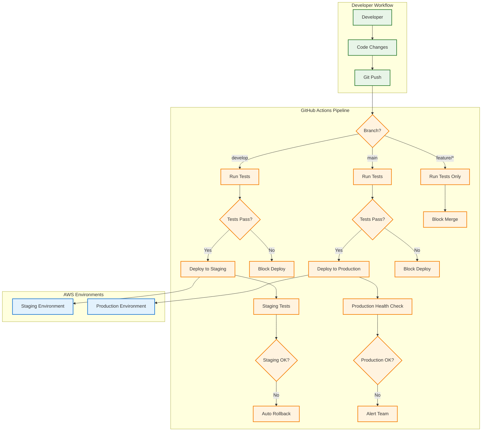

## Table of contents

## TL;DR

Multi-stage deployment essentials:

```bash
# Deploy to different stages
$ serverless deploy --stage dev
$ serverless deploy --stage staging
$ serverless deploy --stage production

# Set up environment-specific configs
# config/production.yml
memorySize: 1024
timeout: 60
```

**Key Features:**

- Environment-specific configurations
- Automated CI/CD pipelines
- Zero-downtime deployments
- Rollback strategies

## Introduction

Moving beyond basic deployment requires a robust multi-stage strategy that ensures code quality, reduces deployment risks, and maintains environment consistency. This part covers setting up development, staging, and production environments with automated CI/CD pipelines.

**Series Progress:**

- **Part 1**: **[Getting Started](/posts/serverless-express-api-part-1-getting-started)** - Setup and basic deployment
- **Part 2**: **[Development Workflow](/posts/serverless-express-api-part-2-development-workflow)** - Local development and testing
- **Part 3** (This article): **Multi-Stage Deployments & CI/CD**
- **Part 4**: **[Production Monitoring & Security](/posts/serverless-express-api-part-4-monitoring-security)** - Monitoring, logging, and security
- **Part 5**: **[Performance & Cost Optimization](/posts/serverless-express-api-part-5-performance-optimization)** - Performance tuning and cost management

## Prerequisites

Before proceeding, ensure you have:

- Completed Parts 1 and 2 of this series
- A working serverless Express API
- AWS credentials with deployment permissions
- Basic understanding of Git workflows

## Multi-Stage Deployment Strategy

### Stage Configuration in `serverless.yml`

Configure dynamic stage management:

```yaml
service: my-serverless-api

provider:
  name: aws
  runtime: nodejs20.x
  region: us-east-1
  stage: ${opt:stage, 'dev'}
  memorySize: ${self:custom.memorySize.${self:provider.stage}, 512}
  timeout: ${self:custom.timeout.${self:provider.stage}, 30}
  environment:
    NODE_ENV: ${self:provider.stage}
    API_VERSION: v1
    LOG_LEVEL: ${self:custom.logLevel.${self:provider.stage}, 'info'}

custom:
  memorySize:
    dev: 512
    staging: 768
    production: 1024

  timeout:
    dev: 30
    staging: 45
    production: 60

  logLevel:
    dev: debug
    staging: info
    production: warn

functions:
  api:
    handler: handler.handler
    events:
      - httpApi: "*"
    environment:
      STAGE: ${self:provider.stage}
```

### Environment-Specific Configurations

Create stage-specific config files and reference them in `serverless.yml`:

```yaml
# serverless.yml
custom: ${file(config/${self:provider.stage}.yml)}

provider:
  memorySize: ${self:custom.memorySize}
  timeout: ${self:custom.timeout}
  tracing:
    lambda: ${self:custom.tracing, false}

# config/production.yml, you can have a similar configuration for other stages as well
memorySize: 1024
timeout: 60
tracing: true
```

### Deployment Commands

```bash
# Deploy to development
$ serverless deploy --stage dev

# Deploy to staging
$ serverless deploy --stage staging

# Deploy to production
$ serverless deploy --stage production

# Deploy with specific region
$ serverless deploy --stage production --region eu-west-1
```

## Environment Variables Management

### Secure Configuration

```yaml
provider:
  environment:
    NODE_ENV: ${self:provider.stage}
    API_VERSION: v1
    # Use AWS Systems Manager for sensitive data
    DB_PASSWORD: ${ssm:/myapp/${self:provider.stage}/db-password~true}
    API_KEY: ${ssm:/myapp/${self:provider.stage}/api-key~true}
```

### Stage-Specific Environment Files

Create `.env` files for each stage:

```bash
# .env.dev
LOG_LEVEL=debug
CORS_ORIGIN=*
RATE_LIMIT=1000

# .env.production
LOG_LEVEL=warn
CORS_ORIGIN=https://myapp.com
RATE_LIMIT=100
```

## CI/CD Pipeline Implementation

### CI/CD Pipeline Overview



**Environment Promotion Strategy:**

| Environment     | Trigger                 | Purpose             | Auto-Deploy         |
| --------------- | ----------------------- | ------------------- | ------------------- |
| **Development** | Any commit to `develop` | Feature testing     | Yes                 |
| **Staging**     | Merge to `develop`      | Integration testing | Yes                 |
| **Production**  | Merge to `main`         | Live users          | Yes (with approval) |
| **Hotfix**      | `hotfix/*` branch       | Critical fixes      | Manual approval     |

### GitHub Actions Workflow

Create `.github/workflows/deploy.yml`. GitHub Actions will automatically trigger this workflow when you push to the `main` or `develop` branch or create a pull request to the `main` branch.

```yaml
name: Deploy Serverless API

on:
  push:
    branches: [main, develop]
  pull_request:
    branches: [main]

jobs:
  test: # This job is used to run tests before deployment. So if you have any tests, you can run them here.
    runs-on: ubuntu-latest
    steps:
      - uses: actions/checkout@v4

      - uses: actions/setup-node@v4
        with:
          node-version: "20"
          cache: "npm"

      - name: Install dependencies
        run: npm ci

      - name: Run tests
        run: npm test

      - name: Run linting
        run: npm run lint

  deploy-staging:
    needs: test
    runs-on: ubuntu-latest
    if: github.ref == 'refs/heads/develop' # This is a condition to check if the current branch is the develop branch. This is usually a defensive check as we already trigger the workflow on the develop branch.
    steps:
      - uses: actions/checkout@v4

      - uses: actions/setup-node@v4
        with:
          node-version: "20"
          cache: "npm"

      - name: Install dependencies
        run: npm ci

      - name: Install Serverless Framework
        run: npm install -g serverless

      - name: Deploy to Staging
        env:
          AWS_ACCESS_KEY_ID: ${{ secrets.AWS_ACCESS_KEY_ID }} # This is a secret that is stored in the GitHub Actions secrets. You can store your AWS credentials here.
          AWS_SECRET_ACCESS_KEY: ${{ secrets.AWS_SECRET_ACCESS_KEY }} # This is a secret that is stored in the GitHub Actions secrets. You can store your AWS credentials here.
        run: serverless deploy --stage staging

  deploy-production:
    needs: test # This is a dependency of the test job. So the deploy-production job will only run if the test job has passed.
    runs-on: ubuntu-latest
    if: github.ref == 'refs/heads/main' # This is a condition to check if the current branch is the main branch. This is usually a defensive check, as we already trigger the workflow on the main branch.
    steps:
      - uses: actions/checkout@v4

      - uses: actions/setup-node@v4
        with:
          node-version: "20"
          cache: "npm"

      - name: Install dependencies
        run: npm ci

      - name: Install Serverless Framework
        run: npm install -g serverless

      - name: Deploy to Production
        env:
          AWS_ACCESS_KEY_ID: ${{ secrets.AWS_ACCESS_KEY_ID }} # This is a secret that is stored in the GitHub Actions secrets. You can store your AWS credentials here.
          AWS_SECRET_ACCESS_KEY: ${{ secrets.AWS_SECRET_ACCESS_KEY }} # This is a secret that is stored in the GitHub Actions secrets. You can store your AWS credentials here.
        run: serverless deploy --stage production
```

### Deployment Scripts

Create `scripts/deploy.sh` for manual deployments. This script is used to deploy the API to a specific stage and region.

```bash
#!/bin/bash

STAGE=${1:-dev}
REGION=${2:-us-east-1}

echo "Deploying to stage: $STAGE in region: $REGION"

# Run tests
npm test

# Deploy
serverless deploy --stage $STAGE --region $REGION

# Run post-deployment tests
npm run test:integration -- --stage $STAGE

echo "Deployment completed successfully!"
```

## Zero-Downtime Deployment Strategies

### Blue-Green Deployments

By default, Serverless Framework will create a new version of the function when you deploy. You can configure the deployment bucket to version the functions.

```yaml
provider:
  deploymentBucket:
    name: my-serverless-deployments-${self:provider.region}
    versioning: true

  versionFunctions: true # Default is true. So we don't need to explicitly set it. But if you want to disable it, you can set it to false.

functions:
  api:
    handler: handler.handler
    events:
      - httpApi: "*"
```

> Note: We need to make sure that we have a plugin or mechanism to handle versioning of functions. As they do not automatically clean up old versions.

### Canary Deployments

Use AWS Lambda aliases for gradual rollouts:

```yaml
functions:
  api:
    handler: handler.handler
    events:
      - httpApi: "*"
    # Canary deployment configuration
    deploymentSettings:
      type: Canary10Percent5Minutes
      alias: Live
```

> Note: To support canary deployments, you will need to install the `serverless-plugin-canary-deployments` plugin. Refer to the [Serverless Plugin Canary Deployments](https://www.serverless.com/plugins/serverless-plugin-canary-deployments#serverless-plugin-canary-deployments) for more details.

## Environment Promotion Strategy

### Git Branch Strategy

```
main (production)
├── develop (staging)
│   ├── feature/user-auth
│   └── feature/payment-integration
└── hotfix/critical-bug
```

### Promotion Workflow

1. **Development**: Feature branches → `develop` → staging deployment
2. **Testing**: QA testing on staging environment
3. **Production**: `develop` → `main` → production deployment
4. **Hotfixes**: Direct to `main` for critical issues

## Configuration Management

### AWS Systems Manager Integration

Store sensitive configuration in AWS Systems Manager:

```bash
# Store database password
$ aws ssm put-parameter \
  --name "/myapp/production/db-password" \
  --value "your-secure-password" \
  --type "SecureString"

# Store API keys
$ aws ssm put-parameter \
  --name "/myapp/production/api-key" \
  --value "your-api-key" \
  --type "SecureString"
```

Reference in `serverless.yml`:

```yaml
provider:
  environment:
    DB_PASSWORD: ${ssm:/myapp/${self:provider.stage}/db-password~true}
    API_KEY: ${ssm:/myapp/${self:provider.stage}/api-key~true}
```

## Testing Strategy

### Pre-Deployment Testing

```yaml
# package.json scripts
{
  "scripts":
    {
      "test": "jest",
      "test:unit": "jest --testPathPattern=unit",
      "test:integration": "jest --testPathPattern=integration",
      "test:e2e": "jest --testPathPattern=e2e",
      "lint": "eslint src/",
      "deploy:dev": "serverless deploy --stage dev",
      "deploy:staging": "serverless deploy --stage staging",
      "deploy:prod": "serverless deploy --stage production",
    },
}
```

### Post-Deployment Validation

```javascript
// tests/integration/health.test.js
const axios = require("axios");

describe("Health Check", () => {
  const baseUrl = process.env.API_ENDPOINT || "http://localhost:3000";

  test("should return healthy status", async () => {
    const response = await axios.get(`${baseUrl}/health`);

    expect(response.status).toBe(200);
    expect(response.data.status).toBe("healthy");
  });
});
```

## Rollback Strategies

### Quick Rollback Commands

```bash
# List recent deployments
$ serverless deploy list --stage production

# Rollback to previous version
$ serverless rollback --timestamp 2023-11-22T10:30:00.000Z --stage production

# Rollback function to specific version
$ serverless rollback function --function api --version 5 --stage production
```

### Automated Rollback

```yaml
# GitHub Actions rollback job
rollback-production:
  runs-on: ubuntu-latest
  if: failure()
  steps:
    - name: Rollback Production
      env:
        AWS_ACCESS_KEY_ID: ${{ secrets.AWS_ACCESS_KEY_ID }}
        AWS_SECRET_ACCESS_KEY: ${{ secrets.AWS_SECRET_ACCESS_KEY }}
      run: |
        serverless rollback --stage production
```

## Environment Monitoring

### Deployment Status Checks

```bash
# Check deployment status
$ serverless info --stage production

# Verify function versions
$ aws lambda list-versions-by-function \
  --function-name my-serverless-api-production-api

# Check API Gateway status
$ aws apigatewayv2 get-apis
```

### Health Check Integration

```javascript
// src/routes/health.js
app.get("/health", (req, res) => {
  res.json({
    status: "healthy",
    timestamp: new Date().toISOString(),
    stage: process.env.NODE_ENV,
    version: process.env.API_VERSION,
  });
});
```

## Troubleshooting Deployments

### Common Issues

**Issue**: Stage-specific configuration not loading

```bash
# Solution: Verify config file exists
$ ls -la config/
$ cat config/production.yml
```

**Issue**: Environment variables not set

```bash
# Solution: Check Systems Manager parameters
$ aws ssm get-parameter --name "/myapp/production/db-password" --with-decryption
```

**Issue**: Deployment stuck or failed

```bash
# Solution: Check CloudFormation stack
$ aws cloudformation describe-stacks --stack-name my-serverless-api-production
$ aws cloudformation describe-stack-events --stack-name my-serverless-api-production
```

## Best Practices

### 1. Environment Parity

- Keep staging as close to production as possible
- Use the same Node.js versions across environments
- Mirror production data structure in staging

### 2. Configuration Management

- Never commit secrets to version control
- Use AWS Systems Manager for sensitive data
- Validate configuration before deployment

### 3. Testing Strategy

- Run comprehensive tests before each deployment
- Include integration tests in the CI pipeline
- Perform smoke tests after deployment

### 4. Deployment Safety

- Always deploy to staging first
- Use feature flags for risky changes
- Have a rollback plan ready

## Quick Reference

```bash
# Multi-stage deployment commands
$ serverless deploy --stage dev
$ serverless deploy --stage staging
$ serverless deploy --stage production

# Environment management
$ serverless info --stage production
$ serverless logs -f api --stage production

# Rollback commands
$ serverless rollback --stage production
$ serverless remove --stage staging
```

## Conclusion

You now have a robust multi-stage deployment strategy with automated CI/CD pipelines.

## What's Next?

Ready to continue? Check out **[Part 4: Production Monitoring & Security](/posts/serverless-express-api-part-4-monitoring-security)** to learn comprehensive monitoring, logging, and security best practices for your production APIs.
