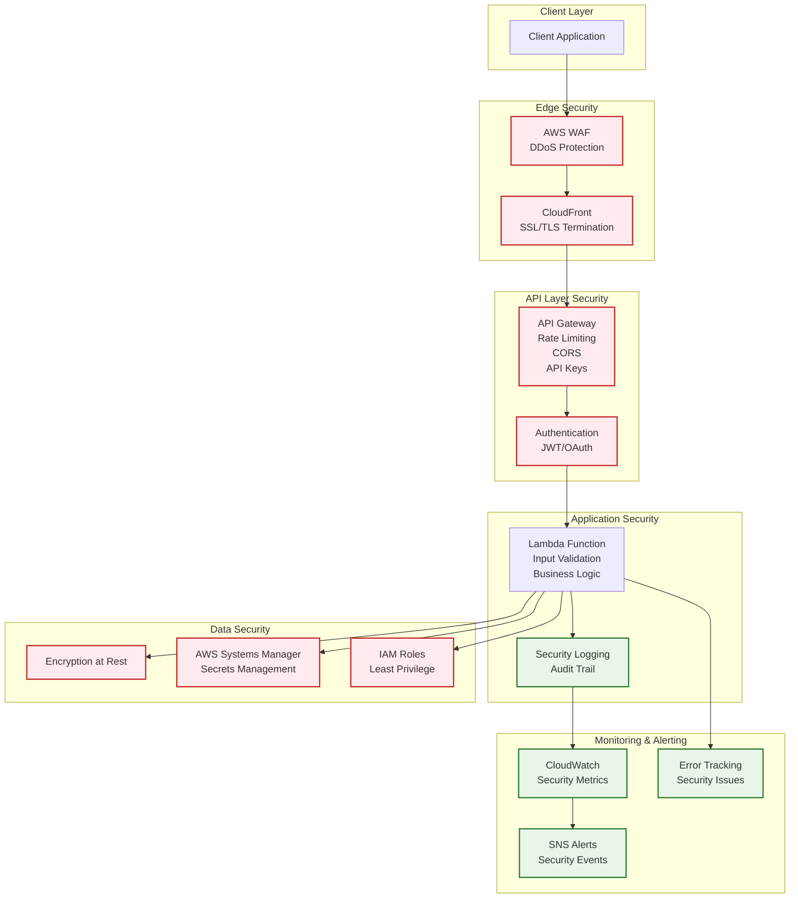

## Table of contents

## TL;DR

Production monitoring and security essentials:

```bash
# Monitor real-time logs
serverless logs -f api --tail --stage production

# Set up CloudWatch alarms in serverless.yml
resources:
  Resources:
    LambdaErrorAlarm:
      Type: AWS::CloudWatch::Alarm
      # ... alarm configuration
```

**Key Security Features:**

- Input validation and rate limiting
- IAM least privilege permissions
- Structured logging with Winston
- CloudWatch alarms and monitoring

## Introduction

Production APIs require robust monitoring and security to ensure reliability, performance, and protection against threats. This part covers implementing comprehensive monitoring with CloudWatch, structured logging, error tracking, and essential security practices.

**Series Progress:**

- **Part 1**: **[Getting Started](/posts/serverless-express-api-part-1-getting-started)** - Setup and basic deployment
- **Part 2**: **[Development Workflow](/posts/serverless-express-api-part-2-development-workflow)** - Local development and testing
- **Part 3**: **[Multi-Stage Deployments & CI/CD](/posts/serverless-express-api-part-3-multi-stage-deployments)** - Environment management and CI/CD
- **Part 4** (This article): **Production Monitoring & Security**
- **Part 5**: **[Performance & Cost Optimization](/posts/serverless-express-api-part-5-performance-optimization)** - Performance tuning and cost management

## Prerequisites

Before proceeding, ensure you have:

- Completed Parts 1-3 of this series
- A deployed serverless Express API
- AWS credentials with CloudWatch permissions
- Basic understanding of security principles

## CloudWatch Monitoring

### Enable Detailed Monitoring

Configure comprehensive monitoring in `serverless.yml`:

```yaml
provider:
  name: aws
  runtime: nodejs20.x
  tracing:
    lambda: true
    apiGateway: true
  logs:
    httpApi: true

functions:
  api:
    handler: handler.handler
    reservedConcurrency: 100
    events:
      - httpApi: "*"
```

### CloudWatch Alarms

The Serverless Framework allows you to define AWS infrastructure resources directly in your `serverless.yml` file using the `resources` section. This section supports standard [AWS CloudFormation resources](https://www.serverless.com/framework/docs/providers/aws/guide/resources#aws-infrastructure-resources), enabling you to create CloudWatch alarms, SNS topics, and other AWS services alongside your Lambda functions.

**Set up automated monitoring with CloudWatch alarms:**

```yaml
# serverless.yml
resources:
  Resources:
    # Lambda Error Alarm
    LambdaErrorAlarm:
      Type: AWS::CloudWatch::Alarm
      Properties:
        AlarmName: ${self:service}-${self:provider.stage}-lambda-errors
        AlarmDescription: "Alert when Lambda function has errors"
        MetricName: Errors
        Namespace: AWS/Lambda
        Statistic: Sum
        Period: 300
        EvaluationPeriods: 2
        Threshold: 5
        ComparisonOperator: GreaterThanThreshold
        Dimensions:
          - Name: FunctionName
            Value: ${self:service}-${self:provider.stage}-api
        AlarmActions:
          - !Ref AlertTopic

    # SNS Topic for Alerts
    AlertTopic:
      Type: AWS::SNS::Topic
      Properties:
        TopicName: ${self:service}-${self:provider.stage}-alerts
        DisplayName: "${self:service} ${self:provider.stage} Alerts"

    # Email Subscription
    AlertEmailSubscription:
      Type: AWS::SNS::Subscription
      Properties:
        Protocol: email
        TopicArn: !Ref AlertTopic
        Endpoint: alerts@yourcompany.com
```

> **Note:** This is a basic example with error monitoring. You can add more alarms as needed for duration, throttles, concurrent executions, API Gateway 4XX/5XX errors, and other metrics based on your specific requirements.

**Key benefits of using the `resources` section:**

- **Infrastructure as Code**: All AWS resources defined alongside your functions
- **Automatic Cleanup**: Resources are removed when you run `serverless remove`
- **Environment Consistency**: Same infrastructure across dev/staging/production
- **CloudFormation Integration**: Full access to AWS CloudFormation resource types
- **Variable Support**: Use Serverless variables like `${self:service}` and `${self:provider.stage}`

**Common metrics you can monitor:** Errors, Duration, Throttles, ConcurrentExecutions, API Gateway 4XX/5XX errors, and custom application metrics.

### Real-time Log Monitoring

```bash
# Monitor production logs in real-time
serverless logs -f api --tail --stage production

# Filter logs by time
serverless logs -f api --startTime 1h --stage production

# Monitor specific log patterns
serverless logs -f api --filter "ERROR" --tail --stage production
```

## Structured Logging

### Winston Logger Implementation

Use Winston for structured JSON logging in production:

```javascript
// utils/logger.js
const winston = require("winston");

const logger = winston.createLogger({
  level: process.env.LOG_LEVEL || "info",
  format: winston.format.combine(
    winston.format.timestamp(),
    winston.format.errors({ stack: true }),
    winston.format.json()
  ),
  transports: [new winston.transports.Console()],
});

// Usage: logger.info('Request received', { method, path, requestId });
module.exports = logger;
```

> Note: We can also use another standard library for request logging, like `morgan` or `bunyan`.

### Application Logging Integration

```javascript
// handler.js
const logger = require("./utils/logger");

// Request logging middleware
app.use((req, res, next) => {
  const requestId = req.get("X-Request-ID") || generateRequestId();
  req.requestId = requestId;

  logger.info("Request received", {
    method: req.method,
    path: req.path,
    userAgent: req.get("User-Agent"),
    ip: req.ip,
    requestId,
  });

  next();
});

// Error logging middleware
app.use((err, req, res, next) => {
  logger.error("Application error", {
    error: err.message,
    stack: err.stack,
    method: req.method,
    path: req.path,
    requestId: req.requestId,
  });

  res.status(500).json({
    error: "Internal Server Error",
    requestId: req.requestId,
  });
});
```

### Log Correlation

```javascript
// utils/correlation.js
const { v4: uuidv4 } = require("uuid");

const generateRequestId = () => uuidv4();

const correlationMiddleware = (req, res, next) => {
  const requestId = req.get("X-Request-ID") || generateRequestId();
  req.requestId = requestId;
  res.set("X-Request-ID", requestId);
  next();
};

module.exports = { correlationMiddleware, generateRequestId };
```

## Security Best Practices

### Security Architecture Overview



**Security Checklist by Layer:**

| Layer           | Security Measures                   | Implementation     |
| --------------- | ----------------------------------- | ------------------ |
| **Edge**        | DDoS protection, SSL/TLS            | CloudFront + WAF   |
| **API**         | Rate limiting, CORS, Authentication | API Gateway + JWT  |
| **Application** | Input validation, Error handling    | Express middleware |
| **Data**        | Encryption, Secrets management      | SSM + IAM roles    |
| **Monitoring**  | Audit logging, Alerting             | CloudWatch + SNS   |

### Input Validation

Implement comprehensive request validation:

```javascript
// middleware/validation.js
const Joi = require("joi");

const validateUser = (req, res, next) => {
  const schema = Joi.object({
    name: Joi.string().min(2).max(50).required(),
    email: Joi.string().email().required(),
    age: Joi.number().integer().min(18).max(120),
  });

  const { error } = schema.validate(req.body);
  if (error) {
    return res.status(400).json({
      error: "Validation failed",
      details: error.details.map(d => d.message),
      requestId: req.requestId,
    });
  }

  next();
};

// Usage
app.post("/api/users", validateUser, (req, res) => {
  // Handle validated request
});
```

### Rate Limiting

Configure API Gateway throttling:

```yaml
functions:
  api:
    events:
      - httpApi:
          path: "*"
          method: "*"
          throttle:
            burstLimit: 200
            rateLimit: 100
```

### CORS Configuration

```yaml
functions:
  api:
    events:
      - httpApi:
          path: "*"
          method: "*"
          cors:
            allowedOrigins:
              - https://myapp.com
              - https://www.myapp.com
            allowedHeaders:
              - Content-Type
              - Authorization
              - X-Amz-Date
              - X-Api-Key
            allowedMethods:
              - GET
              - POST
              - PUT
              - DELETE
              - OPTIONS
            maxAge: 86400
```

### IAM Security

**IAM permissions (least privilege):**

```yaml
provider:
  iamRoleStatements:
    - Effect: Allow
      Action:
        - dynamodb:GetItem
        - dynamodb:PutItem
      Resource: "arn:aws:dynamodb:${self:provider.region}:*:table/Users"
```

> Note: These are example permissions for a DynamoDB table. You can add more permissions as needed.

### Environment Variables Security

```yaml
provider:
  environment:
    NODE_ENV: production
    API_VERSION: v1
    # Use AWS Systems Manager for sensitive data
    DB_PASSWORD: ${ssm:/myapp/production/db-password~true}
    API_KEY: ${ssm:/myapp/production/api-key~true}
```

## Error Tracking & Monitoring

### Health Check Endpoint

**Comprehensive health check endpoint:**

```javascript
app.get("/health", async (req, res) => {
  const health = {
    status: "healthy",
    timestamp: new Date().toISOString(),
    uptime: process.uptime(),
    environment: process.env.NODE_ENV,
    version: process.env.API_VERSION,
    checks: {},
  };

  try {
    // Database connectivity check
    const db = getPool();
    await db.execute("SELECT 1");
    health.checks.database = "healthy";
  } catch (error) {
    health.checks.database = "unhealthy";
    health.status = "degraded";
  }

  // Memory usage check
  const memUsage = process.memoryUsage();
  health.checks.memory = {
    used: Math.round(memUsage.heapUsed / 1024 / 1024),
    total: Math.round(memUsage.heapTotal / 1024 / 1024),
    status:
      memUsage.heapUsed < memUsage.heapTotal * 0.9 ? "healthy" : "warning",
  };

  const statusCode = health.status === "healthy" ? 200 : 503;
  res.status(statusCode).json(health);
});
```

**Error tracking:** Integrate services like Sentry for production error monitoring and alerting.

### Sentry Integration

```javascript
// utils/sentry.js
const Sentry = require("@sentry/node");

if (process.env.NODE_ENV === "production") {
  Sentry.init({
    dsn: process.env.SENTRY_DSN,
    environment: process.env.NODE_ENV,
    tracesSampleRate: 0.1,
  });
}

// Error handling middleware
app.use((err, req, res, next) => {
  if (process.env.NODE_ENV === "production") {
    Sentry.captureException(err);
  }

  logger.error("Application error", {
    error: err.message,
    stack: err.stack,
    requestId: req.requestId,
  });

  res.status(500).json({
    error: "Internal Server Error",
    requestId: req.requestId,
  });
});
```

## Custom Metrics

### Application Metrics

```javascript
// utils/metrics.js
const AWS = require("aws-sdk");
const cloudWatch = new AWS.CloudWatch();

const putMetric = async (metricName, value, unit = "Count") => {
  const params = {
    Namespace: "MyApp/API",
    MetricData: [
      {
        MetricName: metricName,
        Value: value,
        Unit: unit,
        Timestamp: new Date(),
      },
    ],
  };

  try {
    await cloudWatch.putMetricData(params).promise();
  } catch (error) {
    logger.error("Failed to put metric", { error: error.message });
  }
};

// Usage
app.post("/api/users", async (req, res) => {
  try {
    // Create user logic
    await putMetric("UserCreated", 1);
    res.json({ success: true });
  } catch (error) {
    await putMetric("UserCreationFailed", 1);
    throw error;
  }
});
```

### Business Metrics Dashboard

```yaml
# CloudWatch Dashboard
resources:
  Resources:
    ApiDashboard:
      Type: AWS::CloudWatch::Dashboard
      Properties:
        DashboardName: ${self:service}-${self:provider.stage}-dashboard
        DashboardBody: !Sub |
          {
            "widgets": [
              {
                "type": "metric",
                "properties": {
                  "metrics": [
                    ["AWS/Lambda", "Invocations", "FunctionName", "${self:service}-${self:provider.stage}-api"],
                    [".", "Errors", ".", "."],
                    [".", "Duration", ".", "."]
                  ],
                  "period": 300,
                  "stat": "Sum",
                  "region": "${AWS::Region}",
                  "title": "Lambda Metrics"
                }
              }
            ]
          }
```

## Security Monitoring

### Security Headers

```javascript
// middleware/security.js
const helmet = require("helmet");

app.use(
  helmet({
    contentSecurityPolicy: {
      directives: {
        defaultSrc: ["'self'"],
        styleSrc: ["'self'", "'unsafe-inline'"],
        scriptSrc: ["'self'"],
        imgSrc: ["'self'", "data:", "https:"],
      },
    },
    hsts: {
      maxAge: 31536000,
      includeSubDomains: true,
      preload: true,
    },
  })
);
```

### Request Monitoring

```javascript
// middleware/security-monitoring.js
const suspiciousPatterns = [
  /(\<script\>)/i,
  /(union.*select)/i,
  /(drop.*table)/i,
];

const securityMonitoring = (req, res, next) => {
  const requestData = JSON.stringify(req.body);

  for (const pattern of suspiciousPatterns) {
    if (pattern.test(requestData)) {
      logger.warn("Suspicious request detected", {
        pattern: pattern.toString(),
        requestId: req.requestId,
        ip: req.ip,
        userAgent: req.get("User-Agent"),
      });

      // Send alert
      putMetric("SuspiciousRequest", 1);
      break;
    }
  }

  next();
};

app.use(securityMonitoring);
```

## Alerting Strategy

### Alert Categories

1. **Critical Alerts** (Immediate response required)

   - Service down (5xx errors > threshold)
   - High error rate (>5% error rate)
   - Security incidents

2. **Warning Alerts** (Response within hours)

   - High latency (>2s response time)
   - Approaching rate limits
   - Memory usage warnings

3. **Info Alerts** (Daily review)
   - Deployment notifications
   - Usage pattern changes
   - Performance trends

### Alert Configuration

```yaml
resources:
  Resources:
    # Critical: High Error Rate
    HighErrorRateAlarm:
      Type: AWS::CloudWatch::Alarm
      Properties:
        AlarmName: ${self:service}-${self:provider.stage}-high-error-rate
        AlarmDescription: "Critical: High error rate detected"
        MetricName: Errors
        Namespace: AWS/Lambda
        Statistic: Sum
        Period: 300
        EvaluationPeriods: 2
        Threshold: 10
        ComparisonOperator: GreaterThanThreshold
        AlarmActions:
          - !Ref CriticalAlertTopic

    # Warning: High Duration
    HighDurationAlarm:
      Type: AWS::CloudWatch::Alarm
      Properties:
        AlarmName: ${self:service}-${self:provider.stage}-high-duration
        AlarmDescription: "Warning: High response time"
        MetricName: Duration
        Namespace: AWS/Lambda
        Statistic: Average
        Period: 300
        EvaluationPeriods: 3
        Threshold: 5000
        ComparisonOperator: GreaterThanThreshold
        AlarmActions:
          - !Ref WarningAlertTopic
```

## Compliance & Auditing

### Audit Logging

```javascript
// middleware/audit.js
const auditLog = (action, resource, userId) => {
  logger.info("Audit log", {
    action,
    resource,
    userId,
    timestamp: new Date().toISOString(),
    requestId: req.requestId,
  });
};

// Usage
app.delete("/api/users/:id", authenticate, (req, res) => {
  const userId = req.user.id;
  const targetUserId = req.params.id;

  auditLog("DELETE_USER", `user:${targetUserId}`, userId);

  // Delete user logic
});
```

### Data Privacy

```javascript
// utils/privacy.js
const sanitizeForLogs = data => {
  const sanitized = { ...data };

  // Remove sensitive fields
  delete sanitised.password;

  delete sanitised.ssn;

  delete sanitised.creditCard;

  // Mask email
  if (sanitised.email) {
    sanitized.email = sanitized.email.replace(/(.{2}).*(@.*)/, "$1***$2");
  }

  return sanitised;
};

// Usage in logging
logger.info("User created", sanitizeForLogs(userData));
```

## Troubleshooting & Debugging

### Debug Mode

```javascript
// utils/debug.js
const debug = require("debug")("myapp:api");

if (process.env.NODE_ENV === "development") {
  debug("Debug mode enabled");
}

// Usage
debug("Processing request for user %s", userId);
```

### Performance Monitoring

```javascript
// middleware/performance.js
const performanceMonitoring = (req, res, next) => {
  const start = Date.now();

  res.on("finish", () => {
    const duration = Date.now() - start;

    logger.info("Request completed", {
      method: req.method,
      path: req.path,
      statusCode: res.statusCode,
      duration,
      requestId: req.requestId,
    });

    // Send performance metric
    putMetric("RequestDuration", duration, "Milliseconds");
  });

  next();
};

app.use(performanceMonitoring);
```

## Quick references

```bash
# Monitoring commands
$ serverless logs -f api --tail --stage production
$ serverless logs -f api --filter "ERROR" --stage production

# CloudWatch commands
$ aws logs describe-log-groups --log-group-name-prefix "/aws/lambda/my-api"
$ aws cloudwatch get-metric-statistics --namespace "AWS/Lambda" --metric-name "Errors"

# Security checks
$ aws iam simulate-principal-policy --policy-source-arn "arn:aws:iam::123456789012:role/lambda-role"
```

## Conclusion

You now have comprehensive monitoring and security in place for your production API.

## What's Next?

Ready to optimise? Check out **[Part 5: Performance & Cost Optimization](/posts/serverless-express-api-part-5-performance-optimization)** to learn advanced performance tuning techniques, cost optimization strategies, and scaling best practices.
