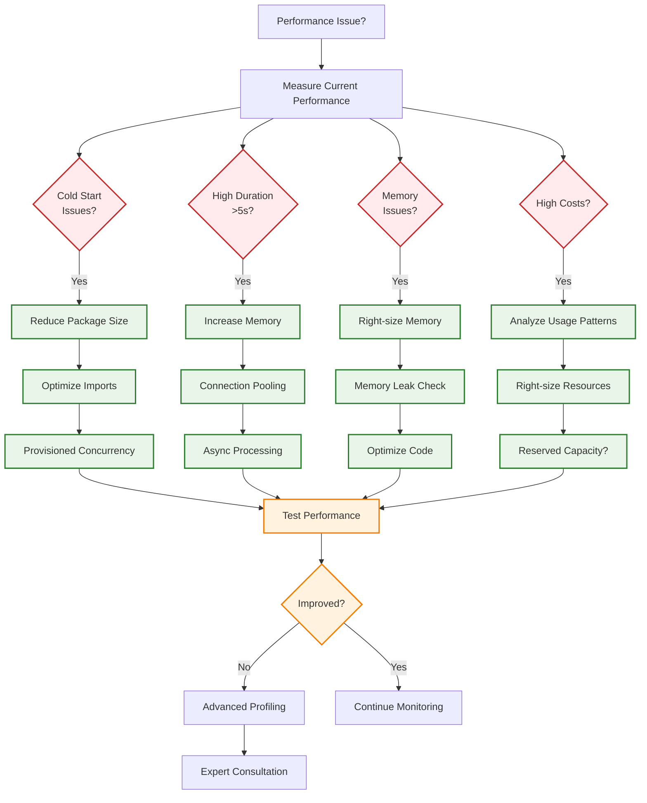

## Table of contents

## TL;DR

Performance and cost optimisation essentials:

```yaml
# Optimise memory and timeout
provider:
  memorySize: 1024 # Sweet spot for most APIs
  timeout: 30

# Enable provisioned concurrency for high-traffic
functions:
  api:
    provisionedConcurrency: 5
```

```bash
# Package optimisation
echo "node_modules/aws-sdk/" >> .serverlessignore
serverless deploy --package-individually
```

**Key Optimization Areas:**

- Cold start mitigation strategies
- Memory and timeout optimisation
- Cost analysis and monitoring
- Performance monitoring and tuning

## Introduction

Optimising serverless applications requires balancing performance, cost, and user experience. This final part covers advanced performance tuning techniques, cost optimisation strategies, and scaling best practices to maximise your API's efficiency while minimising operational costs.

**Series Progress:**

- **Part 1**: **[Getting Started](/posts/serverless-express-api-part-1-getting-started)** - Setup and basic deployment
- **Part 2**: **[Development Workflow](/posts/serverless-express-api-part-2-development-workflow)** - Local development and testing
- **Part 3**: **[Multi-Stage Deployments & CI/CD](/posts/serverless-express-api-part-3-multi-stage-deployments)** - Environment management and CI/CD
- **Part 4**: **[Production Monitoring & Security](/posts/serverless-express-api-part-4-monitoring-security)** - Monitoring, logging, and security
- **Part 5** (This article): **Performance & Cost Optimization**

## Prerequisites

Before proceeding, ensure you have:

- Completed Parts 1-4 of this series
- A production serverless Express API
- CloudWatch monitoring enabled
- Basic understanding of AWS Lambda pricing

## Understanding Lambda Pricing

### Cost Components

Your serverless API runs on AWS Lambda's pay-per-use model, which provides excellent cost efficiency for most applications.

**Cost components:**

- **Request charges:** $0.20 per 1 million requests
- **Duration charges:** Based on memory allocation × execution time
- **Data transfer:** Outbound data transfer costs (minimal for most APIs)

**Basic cost calculation example (Small API):**

```
Memory: 512 MB
Duration: 100ms average
Requests: 10,000/month

Request cost: 10,000 / 1,000,000 × $0.20 = $0.002
Duration cost: 10,000 × 0.1s × $0.0000002083 × (512/1024) = $0.01

Total: ~$0.012 per month
```

**Production cost calculation example (High-traffic API):**

```
Monthly usage: 1M requests
Average duration: 200ms
Memory: 1024MB

Request cost: 1,000,000 / 1,000,000 × $0.20 = $0.20
Duration cost: 1,000,000 × 0.2s × $0.0000002083 × (1024/1024) = $41.66

Total monthly cost: ~$41.86
```

### AWS Free Tier Benefits

Lambda Free Tier (permanent) includes:

- **1 million requests per month**
- **400,000 GB-seconds of compute time per month**

**Most small to medium APIs run completely free under the AWS Free Tier!**

## Performance Optimisation Strategies

### Performance Optimisation Decision Tree



**Performance Optimization Priorities:**

| Priority   | Optimization              | Impact | Effort |
| ---------- | ------------------------- | ------ | ------ |
| **High**   | Right-size memory         | High   | Low    |
| **High**   | Package size optimization | High   | Medium |
| **Medium** | Connection pooling        | Medium | Medium |
| **Medium** | Provisioned concurrency   | High   | Low    |
| **Low**    | Advanced caching          | Medium | High   |

### Cold Start Mitigation

**Package size optimization:**

```bash
# .serverlessignore
node_modules/aws-sdk/
*.test.js
*.spec.js
docs/
.git/
coverage/
.nyc_output/
```

**Optimize imports:**

```javascript
// Instead of importing the entire AWS SDK
const AWS = require("aws-sdk");

// Import only what you need
const { DynamoDB } = require("aws-sdk");
// Or even better, use v3 SDK
const { DynamoDBClient } = require("@aws-sdk/client-dynamodb");
```

### Memory Optimisation

**Find the optimal memory allocation:**

```yaml
# Test different memory sizes
provider:
  memorySize: 512 # Start here for simple APIs
  # memorySize: 768   # Test for database operations
  # memorySize: 1024  # Test for heavy processing
```

**Memory recommendations by use case:**

- **Simple APIs:** 512-768 MB
- **Database operations:** 768-1024 MB
- **Heavy processing:** 1024+ MB
- **File processing:** 1536+ MB

### Connection Pooling

**Database connection optimization:**

```javascript
// utils/database.js
const mysql = require("mysql2/promise");

let pool;

const getPool = () => {
  if (!pool) {
    pool = mysql.createPool({
      host: process.env.DB_HOST,
      user: process.env.DB_USER,
      password: process.env.DB_PASSWORD,
      database: process.env.DB_NAME,
      waitForConnections: true,
      connectionLimit: 10,
      queueLimit: 0,
    });
  }
  return pool;
};

module.exports = { getPool };
```

### Provisioned Concurrency

**For high-traffic APIs:**

```yaml
functions:
  api:
    handler: handler.handler
    provisionedConcurrency: 5 # Keep 5 instances warm
    events:
      - httpApi: "*"
```

**When to use provisioned concurrency:**

- Consistent traffic patterns
- Latency-sensitive applications
- Cold start times > 1 second
- Cost justifies the reserved capacity

## Advanced Performance Techniques

### Response Caching

```javascript
// middleware/cache.js
const NodeCache = require("node-cache");
const cache = new NodeCache({ stdTTL: 300 }); // 5 minutes

const cacheMiddleware = (duration = 300) => {
  return (req, res, next) => {
    const key = req.originalUrl;
    const cached = cache.get(key);

    if (cached) {
      return res.json(cached);
    }

    // Override res.json to cache the response
    const originalJson = res.json;
    res.json = function (data) {
      cache.set(key, data, duration);
      return originalJson.call(this, data);
    };

    next();
  };
};

// Usage
app.get("/api/users", cacheMiddleware(600), getUsersHandler);
```

### Async Processing

```javascript
// utils/async-processor.js
const AWS = require("aws-sdk");
const sqs = new AWS.SQS();

const queueMessage = async (queueUrl, message) => {
  const params = {
    QueueUrl: queueUrl,
    MessageBody: JSON.stringify(message),
  };

  return await sqs.sendMessage(params).promise();
};

// Usage for heavy operations
app.post("/api/process-data", async (req, res) => {
  // Queue heavy processing for background
  await queueMessage(process.env.PROCESSING_QUEUE_URL, {
    operation: "processData",
    data: req.body,
    userId: req.user.id,
  });

  res.json({
    message: "Processing started",
    status: "queued",
  });
});
```

### Compression

```javascript
// Enable gzip compression
const compression = require("compression");

app.use(
  compression({
    level: 6,
    threshold: 1024, // Only compress responses > 1KB
    filter: (req, res) => {
      if (req.headers["x-no-compression"]) {
        return false;
      }
      return compression.filter(req, res);
    },
  })
);
```

## Cost Optimization Strategies

### Right-Sizing Resources

**Memory optimization testing:**

```bash
# Test different memory configurations
serverless deploy --stage test-512 --config serverless-512mb.yml
serverless deploy --stage test-1024 --config serverless-1024mb.yml

# Compare performance and cost
aws logs filter-log-events \
  --log-group-name "/aws/lambda/my-api-test-512-api" \
  --filter-pattern "REPORT"
```

### Package Optimisation

**Use webpack for bundling:**

```bash
npm install --save-dev serverless-webpack webpack babel-loader

# serverless.yml
plugins:
  - serverless-webpack

custom:
  webpack:
    webpackConfig: 'webpack.config.js'
    includeModules: true
    packager: 'npm'
```

**Webpack configuration:**

```javascript
// webpack.config.js
const path = require("path");

module.exports = {
  entry: "./handler.js",
  target: "node",
  mode: "production",
  optimisation: {
    minimise: true,
  },
  module: {
    rules: [
      {
        test: /\.js$/,
        exclude: /node_modules/,
        use: {
          loader: "babel-loader",
          options: {
            presets: ["@babel/preset-env"],
          },
        },
      },
    ],
  },
};
```

### Individual Function Packaging

```yaml
package:
  individually: true
  exclude:
    - node_modules/aws-sdk/**
    - .git/**
    - test/**
    - coverage/**
```

## Cost Monitoring & Analysis

### Cost Allocation Tags

```yaml
provider:
  tags:
    Project: MyServerlessAPI
    Environment: ${self:provider.stage}
    Owner: TeamName
    CostCenter: Engineering

functions:
  api:
    tags:
      Function: APIHandler
      Criticality: High
```

### Cost Alerts

```yaml
resources:
  Resources:
    BillingAlarm:
      Type: AWS::CloudWatch::Alarm
      Properties:
        AlarmName: ${self:service}-${self:provider.stage}-billing-alert
        AlarmDescription: "Alert when monthly costs exceed threshold"
        MetricName: EstimatedCharges
        Namespace: AWS/Billing
        Statistic: Maximum
        Period: 86400
        EvaluationPeriods: 1
        Threshold: 100 # $100 threshold
        ComparisonOperator: GreaterThanThreshold
        Dimensions:
          - Name: Currency
            Value: USD
        AlarmActions:
          - !Ref CostAlertTopic
```

### Usage Analytics

```javascript
// utils/usage-analytics.js
const AWS = require("aws-sdk");
const cloudWatch = new AWS.CloudWatch();

const trackUsage = async (endpoint, userId, responseTime) => {
  const metrics = [
    {
      MetricName: "APICall",
      Value: 1,
      Unit: "Count",
      Dimensions: [
        { Name: "Endpoint", Value: endpoint },
        { Name: "Stage", Value: process.env.NODE_ENV },
      ],
    },
    {
      MetricName: "ResponseTime",
      Value: responseTime,
      Unit: "Milliseconds",
      Dimensions: [{ Name: "Endpoint", Value: endpoint }],
    },
  ];

  await cloudWatch
    .putMetricData({
      Namespace: "MyApp/Usage",
      MetricData: metrics,
    })
    .promise();
};
```

## Scaling Strategies

### Auto Scaling Configuration

```yaml
functions:
  api:
    handler: handler.handler
    reservedConcurrency: 100 # Limit concurrent executions
    events:
      - httpApi: "*"
```

### Load Testing

```javascript
// tests/load/load-test.js
const autocannon = require("autocannon");

const runLoadTest = async () => {
  const result = await autocannon({
    url: process.env.API_ENDPOINT,
    connections: 10,
    pipelining: 1,
    duration: 30,
    headers: {
      "Content-Type": "application/json",
    },
  });

  console.log("Load test results:", result);
};

runLoadTest();
```

### Circuit Breaker Pattern

```javascript
// utils/circuit-breaker.js
class CircuitBreaker {
  constructor(threshold = 5, timeout = 60000) {
    this.threshold = threshold;
    this.timeout = timeout;
    this.failureCount = 0;
    this.lastFailureTime = null;
    this.state = "CLOSED"; // CLOSED, OPEN, HALF_OPEN
  }

  async call(fn) {
    if (this.state === "OPEN") {
      if (Date.now() - this.lastFailureTime > this.timeout) {
        this.state = "HALF_OPEN";
      } else {
        throw new Error("Circuit breaker is OPEN");
      }
    }

    try {
      const result = await fn();
      this.onSuccess();
      return result;
    } catch (error) {
      this.onFailure();
      throw error;
    }
  }

  onSuccess() {
    this.failureCount = 0;
    this.state = "CLOSED";
  }

  onFailure() {
    this.failureCount++;
    this.lastFailureTime = Date.now();

    if (this.failureCount >= this.threshold) {
      this.state = "OPEN";
    }
  }
}
```

## Performance Monitoring

### Custom Performance Metrics

```javascript
// middleware/performance-tracking.js
const performanceTracker = (req, res, next) => {
  const start = process.hrtime();

  res.on("finish", () => {
    const [seconds, nanoseconds] = process.hrtime(start);
    const duration = seconds * 1000 + nanoseconds / 1000000;

    // Track performance by endpoint
    const endpoint = req.route ? req.route.path : req.path;

    logger.info("Performance metric", {
      endpoint,
      method: req.method,
      statusCode: res.statusCode,
      duration,
      memoryUsage: process.memoryUsage(),
      requestId: req.requestId,
    });

    // Send to CloudWatch
    putMetric("EndpointDuration", duration, "Milliseconds", [
      { Name: "Endpoint", Value: endpoint },
      { Name: "Method", Value: req.method },
    ]);
  });

  next();
};
```

### Memory Leak Detection

```javascript
// utils/memory-monitor.js
const monitorMemory = () => {
  const usage = process.memoryUsage();

  logger.info("Memory usage", {
    rss: Math.round(usage.rss / 1024 / 1024),
    heapTotal: Math.round(usage.heapTotal / 1024 / 1024),
    heapUsed: Math.round(usage.heapUsed / 1024 / 1024),
    external: Math.round(usage.external / 1024 / 1024),
  });

  // Alert if memory usage is high
  if (usage.heapUsed > usage.heapTotal * 0.9) {
    logger.warn("High memory usage detected", { usage });
  }
};

// Monitor memory every 30 seconds
setInterval(monitorMemory, 30000);
```

## Troubleshooting Performance Issues

### Common Performance Problems

**Cold Start Issues:**

```yaml
# Solution: Use provisioned concurrency
functions:
  api:
    provisionedConcurrency: 2
```

**Memory Issues:**

```yaml
# Solution: Increase memory allocation
provider:
  memorySize: 1536
```

**Timeout Issues:**

```yaml
# Solution: Increase timeout and optimize code
provider:
  timeout: 60
```

### Performance Debugging

```bash
# Check function performance
aws logs filter-log-events \
  --log-group-name "/aws/lambda/my-api-production-api" \
  --filter-pattern "REPORT" \
  --start-time 1640995200000

# Analyze X-Ray traces
aws xray get-trace-summaries \
  --time-range-type TimeRangeByStartTime \
  --start-time 2023-11-22T00:00:00Z \
  --end-time 2023-11-22T23:59:59Z
```

## Cost Optimization Checklist

| Optimization                | Description                         | Impact | Effort |
| --------------------------- | ----------------------------------- | ------ | ------ |
| **Memory Right-sizing**     | Test and optimize memory allocation | High   | Medium |
| **Package Size**            | Minimize deployment package         | Medium | Low    |
| **Provisioned Concurrency** | Use only when justified             | High   | Low    |
| **Connection Pooling**      | Reuse database connections          | Medium | Medium |
| **Caching**                 | Implement response caching          | High   | Medium |
| **Async Processing**        | Move heavy tasks to background      | High   | High   |
| **Reserved Capacity**       | Consider for predictable workloads  | Medium | Low    |
| **Cost Monitoring**         | Set up billing alerts               | Low    | Low    |

## Best Practices Summary

### Performance Best Practices

1. **Optimize package size** - Remove unnecessary dependencies
2. **Right-size memory** - Test different allocations
3. **Use connection pooling** - Reuse database connections
4. **Implement caching** - Cache frequently accessed data
5. **Monitor performance** - Track key metrics continuously

### Cost Best Practices

1. **Monitor usage patterns** - Understand your traffic
2. **Set billing alerts** - Avoid surprise costs
3. **Use appropriate memory** - Don't over-provision
4. **Consider reserved capacity** - For predictable workloads
5. **Regular cost reviews** - Optimize based on usage

## Quick Reference

```bash
# Performance testing
serverless invoke -f api --data '{"httpMethod":"GET","path":"/"}'
aws logs filter-log-events --log-group-name "/aws/lambda/my-api" --filter-pattern "REPORT"

# Cost monitoring
aws ce get-cost-and-usage --time-period Start=2023-11-01,End=2023-11-30 --granularity MONTHLY

# Optimisation commands
serverless deploy --package-individually
serverless package --stage production
```

## Series Conclusion

Congratulations! You've completed the comprehensive 5-part series on building production-ready serverless Express APIs. You now have the knowledge to:

**Series Achievements:**

- **Part 1**: Set up and deploy serverless Express APIs
- **Part 2**: Master local development workflows
- **Part 3**: Implement multi-stage deployments and CI/CD
- **Part 4**: Add comprehensive monitoring and security
- **Part 5**: Optimize performance and manage costs

**What you've built?**

- Production-ready serverless Express API
- Multi-environment deployment pipeline
- Comprehensive monitoring and alerting
- Security best practices implementation
- Cost-optimised, high-performance application

**Key Benefits Achieved:**

- **Scalability**: Automatic scaling with AWS Lambda
- **Cost Efficiency**: Pay-per-use pricing model
- **Reliability**: Multi-stage testing and deployment
- **Security**: Comprehensive security measures
- **Observability**: Full monitoring and logging

The serverless approach provides incredible scalability and cost-effectiveness while eliminating infrastructure management overhead. You're now equipped to build, deploy, and maintain enterprise-grade serverless APIs.

**Additional Resources:**

- [Serverless Framework Documentation](https://www.serverless.com/framework/docs)
- [AWS Lambda Best Practices](https://docs.aws.amazon.com/lambda/latest/dg/best-practices.html)
